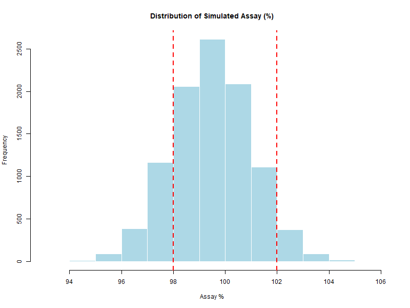
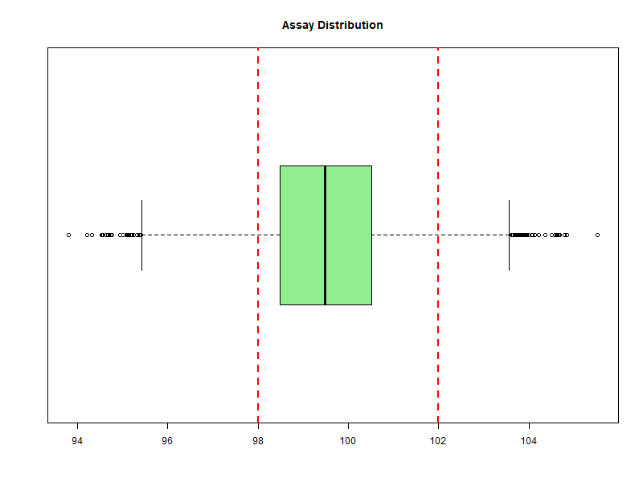

# Chapter 6 – Analysis of Results

Once a Monte Carlo simulation is complete, the next step is to **analyze the simulated data**.  
This allows us to assess compliance with specifications, estimate process capability, and evaluate risks.

---

## 📊 1. Descriptive Statistics

Key metrics to summarize the simulation output:

- **Mean** → central tendency.
- **Standard deviation (SD)** → variability.
- **Minimum / Maximum** → extreme values.
- **Percentiles** → distribution shape and spread.

**R Example:**
```r
summary(Assay)
sd(Assay)
quantile(Assay, probs = c(0.05, 0.95))
```

**95% CI for the Mean**

```r
t.test(Assay)$conf.int
```

---

## 📉 2. Probability of Out-of-Spec (OOS)
The main GMP-related question is often: *"What is the probability that a batch is OOS?"*

**R Example:**

```r
p_out <- mean(Assay < 98 | Assay > 102)
p_out
```

If `p_out` is small (e.g., < 0.1%), the process is considered highly capable.

- **Confidence Interval (95%)**

For a more robust assessment, we can estimate a 95% confidence interval for `p_out` using the `prop.test` function, which provides a score-based CI (Wilson interval).

```r
N <- length(Assay)
x <- sum(Assay < 98 | Assay > 102)
prop.test(x, N)$conf.int
```

---

## 📈 3. Visualizing the Distribution
Graphs make interpretation easier:

- **Histogram** for the overall shape.

- **Boxplot** to detect skewness and outliers.

- **Cumulative distribution function (CDF)** to read probabilities directly.

**R Example:**

```r
png("analysis_histogram.png", width = 800, height = 600)
hist(Assay,
     main = "Distribution of Simulated Assay (%)",
     xlab = "Assay %",
     col = "lightblue",
     border = "white")
abline(v = c(98, 102), col = "red", lwd = 2, lty = 2)
dev.off()

png("analysis_boxplot.png", width = 800, height = 600)
boxplot(Assay, horizontal = TRUE,
        main = "Assay Distribution",
        col = "lightgreen")
abline(v = c(98, 102), col = "red", lwd = 2, lty = 2)
dev.off()
```

<p align="center">  </p> 

<p align="center">  </p>

---

## 📐 4. Capability Indices
For normally distributed data:

$$
Cpk = \min \left( \frac{USL - \mu}{3\sigma}, \frac{\mu - LSL}{3\sigma} \right)
$$

`Cpk = min( (USL - μ)/(3*σ), (μ - LSL)/(3*σ) )`

*Note: the closed-form Cpk formula assumes approximate normality. For non-normal data, consider transformations or percentile-based capability indices.*

**R Example:**

```r
mean_assay <- mean(Assay)
sd_assay   <- sd(Assay)
USL <- 102
LSL <- 98

Cpk <- min((USL - mean_assay) / (3 * sd_assay),
           (mean_assay - LSL) / (3 * sd_assay))
Cpk
```

---

## 💊 Interpretation in GMP Context

- **Low p_out + High Cpk** → process under good control.
- **High p_out or Low Cpk** → potential quality risk; investigate variability sources.
- Visual tools and statistics **together** give the clearest picture.

---
[← Previous: A Complete Simulation in R](chapter05_full-simulation.md) | [▲ back to top](../#table-of-contents) | [Next → Pharmaceutical Case Study](chapter07_case-pharma.md)
