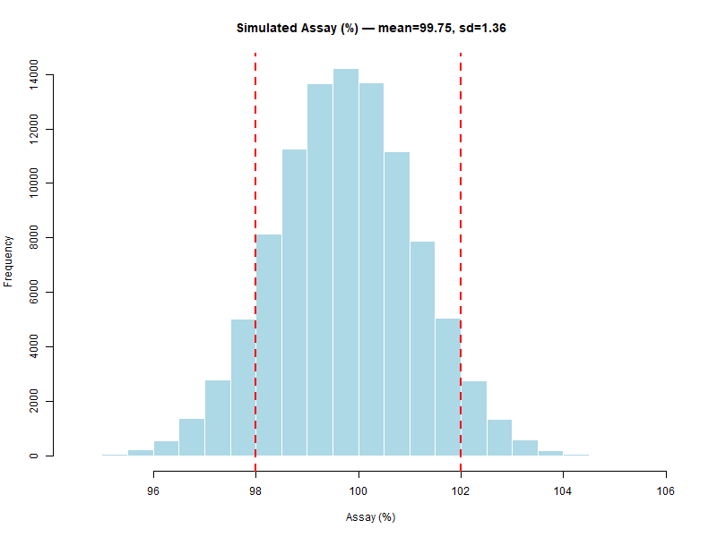

# Chapter 7 — Pharmaceutical Case Study

In this chapter, we present a realistic **GMP pharmaceutical example** to demonstrate the complete Monte Carlo workflow — from defining inputs to interpreting results.

---

## 💊 Scenario: Assay of an API in Finished Tablets

A Quality Control laboratory is validating a new process for producing tablets containing an Active Pharmaceutical Ingredient (API).  
The target assay is **100.0%** with specifications:  
- **LSL = 98.0%**  
- **USL = 102.0%**

---

## 📥 Step 1 – Define Inputs and Distributions

Based on historical data and expert estimates:

| Input Variable    | Distribution  | Parameters                  | Source                  |
|-------------------|--------------|-----------------------------|-------------------------|
| API Weight (mg)   | Normal       | mean = 101, sd = 2           | Production data         |
| Tablet Weight (mg)| Normal       | mean = 250, sd = 5           | Production data         |
| Purity (fraction) | Uniform      | min = 0.98, max = 1.00        | Certificate of Analysis |

---

## 🔗 Step 2 – Define the Transfer Equation

The assay is calculated using the ratio of API weight to tablet weight, multiplied by purity and converted to a percentage:

$$
Assay(\%) = \frac{\text{API}_{\text{weight}}}{\text{Tablet}_{\text{weight}}} \times Purity \times 100
$$

---

## 💻 Step 3 – Run the Simulation in R

```r
set.seed(123)

# Number of simulations
N <- 100000

# NOTE ON VARIABLES:
# - API_weight: measured API content per tablet (mg)
# - Tablet_weight: LABEL CLAIM of API (mg), not total tablet mass
# - Purity: assay purity (fraction), used as correction factor

# 1) Random inputs (choose realistic values so that assay ~ 100%)
API_weight    <- rnorm(N, mean = 100.5, sd = 1.2)  # mg measured API
Tablet_weight <- rnorm(N, mean = 100.0, sd = 0.5)  # mg label claim (API)
Purity        <- runif(N, min = 0.985, max = 1.000)

# 2) Transfer equation
Assay <- (API_weight / Tablet_weight) * Purity * 100

# Quick sanity-check on center and spread
mean_assay <- mean(Assay)
sd_assay   <- sd(Assay)

# 3) Save histogram with specs
png("case_study_hist.png", width = 800, height = 600)
hist(Assay,
     main = sprintf("Simulated Assay (%%) — mean=%.2f, sd=%.2f", mean_assay, sd_assay),
     xlab = "Assay (%)",
     col = "lightblue",
     border = "white")
abline(v = c(98, 102), col = "red", lwd = 2, lty = 2)
dev.off()

# 4) Probability of OOS
p_out <- mean(Assay < 98 | Assay > 102)

# 5) Capability index vs 98–102 (normality assumption)
USL <- 102; LSL <- 98
Cpk <- min((USL - mean_assay) / (3 * sd_assay),
           (mean_assay - LSL) / (3 * sd_assay))

list(mean_assay = mean_assay, sd_assay = sd_assay, p_out = p_out, Cpk = Cpk)
```

---

## 📊 Step 4 – Example Output

- **Histogram** with red dashed lines marking specification limits.
- **Observed results** for this simulation:
  - Mean assay: 99.75%
  - Standard deviation: 1.36%
  - Probability of OOS (`p_out`): ≈ 15%
  - **Cpk**: ≈ 0.43 → far below the GMP-recommended threshold of 1.33

These values indicate a process with **excessive variability** and a **non-negligible risk** of producing batches outside specifications.

> **Note:** This dataset was chosen **deliberately** to illustrate how Monte Carlo simulations can reveal a process that is **not in control**.  
> In a real GMP context, results like these would trigger a root cause investigation and corrective actions to reduce variability and improve process centering.

<p align="center">  </p>

Cpk was calculated as:

$$
Cpk = \min \left( \frac{USL - \mu}{3\sigma}, \frac{\mu - LSL}{3\sigma} \right)
$$

---

## 📌 Step 5 – GMP Interpretation
- **Low p_out**: high compliance probability.
- **High Cpk**: process well-centered and with low variability.
- No immediate corrective action needed, but **continued monitoring** is recommended.

This approach can be extended to:
- Dissolution testing
- Content uniformity
- Stability data projections
- Microbiological limits

This quantitative approach supports risk-based decision-making and can be documented in validation or continued process verification reports.

---
[← Previous: Analysis of Results](chapter06_analysis.md) | [▲ back to top](../#table-of-contents) | [Next → Decision and Risk](chapter08_decision-risk.md)
