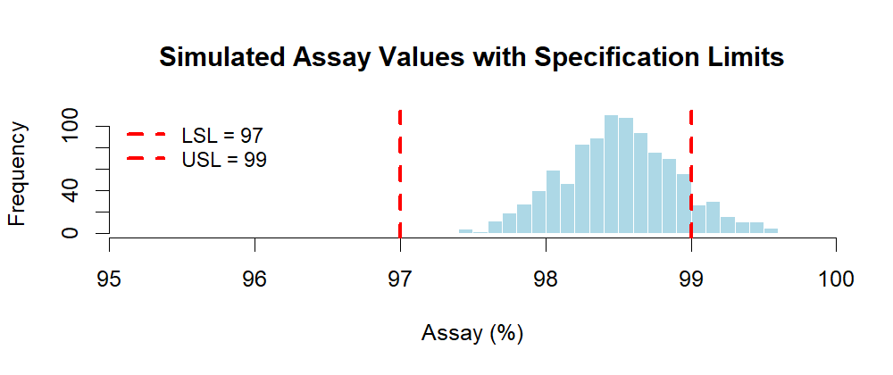

# Chapter 1 – Introduction

Monte Carlo methods are powerful simulation tools widely used in engineering, finance, and increasingly in the **pharmaceutical industry**.

In this chapter, you will:

- Understand what Monte Carlo simulation is.  
- Learn how it can be applied in GMP and pharma operations.  
- See a simple example to build intuition.  

---

## 1️⃣ What is Monte Carlo Simulation?

Monte Carlo simulation is a **computational method** that uses random sampling to estimate numerical results.  

It is especially useful when:

- Analytical solutions are hard or impossible to obtain.  
- The system is too complex for exact formulas.  
- You want to model uncertainty and explore a range of possible outcomes.  

The method takes its name from the **Monte Carlo Casino** in Monaco — a metaphor for randomness, introduced in the 1940s by mathematicians working on complex physics problems.

---

## 2️⃣ Why Monte Carlo in Pharma?

In the pharmaceutical and GMP context, Monte Carlo simulation can help:

- Estimate the probability of out-of-specification (OOS) results.  
- Predict process capability with uncertainty.  
- Support regulatory decisions with quantitative evidence.  
- Model measurement uncertainty in QC laboratories.  
- Evaluate sampling plans and acceptance criteria.  

These applications make Monte Carlo not only a statistical curiosity, but a **practical decision-support tool** for QA, QC, and manufacturing.

---

## 📊 A Simple Example in R

Let’s simulate a **QC assay** that follows a Normal distribution:  
- Mean assay result = 98.0  
- Standard deviation = 0.4  
- Specifications: LSL = 97.0, USL = 99.0  

```r
set.seed(123)
x <- rnorm(10000, mean = 98.0, sd = 0.4)

# Estimate probability of OOS (out of specification)
mean(x < 97.0 | x > 99.0)
```

> 💡 **Optional Visualization**  
> Instead of only looking at the calculated OOS risk, we can *visualize* it.  
> The histogram below shows 1,000 simulated assay values with specification limits (97% – 99%).  
> You can clearly see some values falling outside the limits, which matches the estimated OOS probability.  

```r
set.seed(123)
x <- rnorm(1000, mean = 98.5, sd = 0.4)
hist(x,
     breaks = 30,
     main = "Simulated Assay Values with Specification Limits",
     xlab  = "Assay (%)",
     col   = "lightblue",
     border= "white",
     xlim  = c(95, 100),   
     xaxs  = "i")          
abline(v = 97, col = "red", lwd = 3, lty = 2)  # LSL
abline(v = 99, col = "red", lwd = 3, lty = 2)  # USL
legend("topleft", c("LSL = 97", "USL = 99"),
       lty = 2, lwd = 3, col = "red", bty = "n", cex = 0.9)

<p align="center">
  
  <br>
  <em>Figure 1.x – Histogram of simulated assay values with specification limits.</em>
</p>

```

➡️ What happens here?

1. We generate **10,000 virtual assay results** (like simulating 10,000 potential batches).

2. We check how many of them fall outside the specifications.

The simulation shows an **OOS risk ≈ 0.012 (1.2%).**
This matches the theoretical calculation (~1.24%), confirming the accuracy of the Monte Carlo approach.

This simple experiment illustrates the core idea of Monte Carlo:

- Use random sampling to model uncertainty.
- Estimate probabilities and risks that are not obvious from one single observation.
- Translate statistics into **practical GMP insights** — here, the risk of batch rejection.

---

## 👥 Who this is for
- QA/QC professionals in GMP environments  
- Manufacturing & Process engineers  
- Data/statistics practitioners in pharma seeking practical R examples  

---

## 🚫 What’s not covered
- This is **not** a full statistics course  
- This is **not** a regulatory guideline, but a practical supplement  

[▲ back to top](../#table-of-contents) | [Next → Random Numbers vs. Random Variates](chapter02_random-variates.md)
