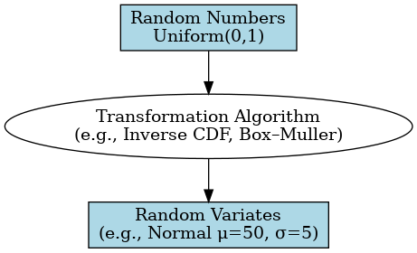
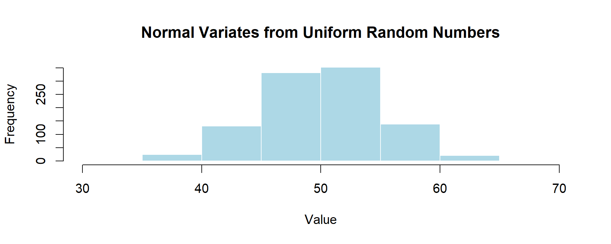

# Chapter 2 – Random Numbers vs. Random Variates

Monte Carlo simulations require *randomness*, but not all randomness is the same.  
In this chapter, we clarify a crucial distinction:

---

## 🎲 Random Numbers
- **Definition:** Numbers generated without a predictable pattern, usually between 0 and 1.
- **Source:** Often produced by a *pseudo-random number generator* (PRNG) in software.
- **Example in R:**
  ```r
  runif(5)  # Generates 5 random numbers between 0 and 1
  ```

**Key Point:** These are “raw” random values — they are not yet tied to any specific probability distribution.

## 📈 Random Variates

- **Definition:** Values drawn from a specific probability distribution using random numbers as input.

- **Example:** Transforming random numbers into normally distributed values.

- **Example in R:**
  ```r
  rnorm(5, mean = 100, sd = 15)  # 5 normal variates with mean 100, sd 15
  ```

- **Key Point:** Random variates are random numbers mapped to a model of the real world.

## 🔄 From Numbers to Variates

<p align="center">
  
  <br>
  <em>Figure 2.1 – From Random Numbers to Random Variates</em>
</p>

1. Generate uniform random numbers.

2. Apply a transformation (inverse CDF or algorithm) to match the target distribution.

3. Obtain random variates that reflect the desired model.

**Example in R – Transforming Uniform → Normal**
```r
u <- runif(1000)
x <- qnorm(u, mean = 50, sd = 5)

hist(x,
     main = "Normal Variates from Uniform Random Numbers",
     xlab = "Value",
     col = "lightblue",
     border = "white")
```
➡️ What happens here?

1. We first generate 1,000 **uniform random numbers** between 0 and 1.  
2. We then apply the **inverse Normal CDF** (`qnorm`) to transform them into values that follow a Normal distribution (mean = 50, sd = 5).  
3. The histogram shows that the values now follow the familiar bell-shaped curve.  

This demonstrates the core idea:  

- **Uniform random numbers** are the raw material.  
- **Random variates** are shaped into a distribution that models real-world phenomena (e.g., tablet weight around 50 mg).  

<p align="center">
  
  <br>
  <em>Figure 2.2 – Transforming Uniform Random Numbers into Normal Variates (mean = 50, sd = 5)</em>
</p>

## 💊 Why It Matters in Pharma

In pharmaceutical applications:

- **Random Numbers** simulate uncertainty without a specific context.

- **Random Variates** simulate actual process or measurement data (e.g., tablet weight, assay results).

- Using the wrong one may lead to unrealistic results.

---

[← Previous: Introduction](chapter01_intro.md) | [▲ back to top](../#table-of-contents) | [Next → Simple Distributions](chapter03_distributions.md)
