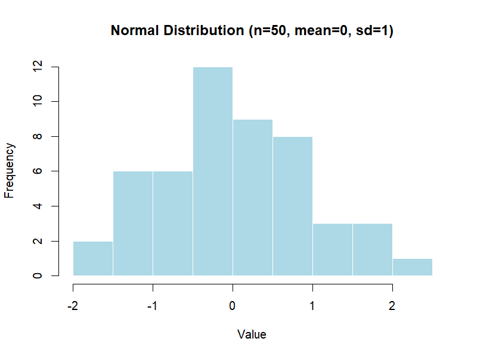
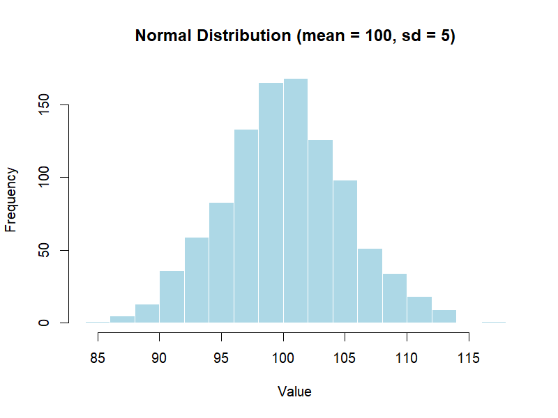
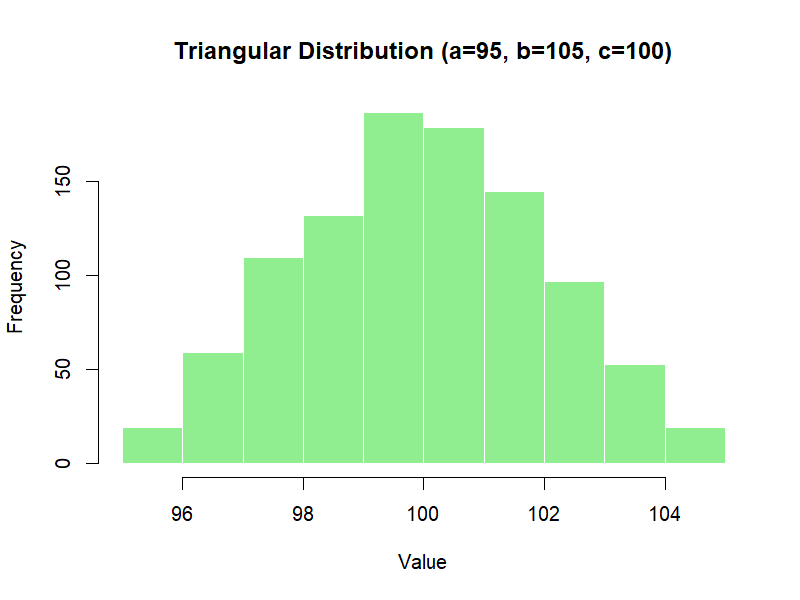

# Chapter 3 – Simple Distributions

Monte Carlo simulations rely on probability distributions to model uncertainty.  

---

> 💡 **What do we mean by uncertainty?**  
> In GMP and pharmaceutical work, uncertainty means we cannot predict exactly what value will occur —  
> only the *range* and *likelihood* of possible values.  
> 
> Examples:  
> - The assay of an API: usually near 98%, but with natural lab variability.  
> - The weight of a tablet: centered at 100 mg, but not every tablet weighs exactly 100 mg.  
> - The time to equipment failure: unpredictable, but often follows a statistical pattern.  
> 
> Probability distributions are the tools we use to **describe and simulate this uncertainty**.

In this chapter, we review four common distributions used in GMP & Pharma applications, with visual examples.

---

## 📊 1. Uniform Distribution

- **Definition:** All values in a given range have the same probability.
- **Parameters:** `a` = minimum, `b` = maximum.
- **R Example:**
  ```r
  runif(50, min = 40, max = 60)  # 50 values between 40 and 60
  ```
- **Use in Pharma:** Modeling tolerance bands where all outcomes within limits are equally likely.

<p align="center">  </p>

---

## 📊 2. Normal Distribution

- **Definition:** The famous bell curve, symmetric around the mean.
- **Parameters:** `μ` = mean, `σ` = standard deviation.

- **R Example:**
 ```r
rnorm(50, mean = 0, sd = 1)  # 50 standard normal values
```
- **Use in Pharma:** Measurement errors, assay results, tablet weights.

<p align="center">  </p>

---

## 📊 3. Exponential Distribution

- **Definition:** Models the time between independent events.
- **Parameter:** `λ` = rate (events per time unit).

- **R Example:**
```r
rexp(50, rate = 1)  # 50 exponential values with λ = 1
```
- **Use in Pharma:** Time to microbial contamination, equipment failure.

<p align="center">  </p>

---

## 📊 4. Triangular Distribution

- **Definition:** Defined by a minimum `a`, a maximum `b`, and a most likely value `c`.

- **R Example** (using triangle package):
```r
library(triangle)
rtriangle(50, a = 0, b = 3, c = 1)
```
- **Use in Pharma:** When only expert estimates (min, most likely, max) are available.

<p align="center">  </p>

---

## 📌 Choosing a Distribution – Quick Guide

| Distribution | When to Use | Example in Pharma |
|--------------|-------------|-------------------|
| **Uniform** | All values in a range equally likely | Early risk assessment with no prior data |
| **Normal** | Natural variation around a mean | Assay results, tablet weights |
| **Exponential** | Time between rare events | Time to microbial contamination, pump failure |
| **Triangular** | Only min, most likely, and max are known | Expert estimates for stability loss |

🔎 **Note:** In the small-sample examples (n = 50), distributions may look irregular due to random variation.  
With larger samples (see illustrative examples, n = 1000), the histograms converge toward the smooth theoretical shapes.  
This reflects a key principle of Monte Carlo simulation: results depend on the number of random draws.

---

## 📊 Illustrative Examples

Instead of looking at just 50 numbers, we can simulate 1,000 values and visualize them.

### Normal Distribution
```r
set.seed(123)
x <- rnorm(1000, mean = 100, sd = 5)

hist(x,
     main = "Normal Distribution (mean = 100, sd = 5)",
     xlab = "Value",
     col = "lightblue",
     border = "white")
```
The histogram shows the classic **bell-shaped curve**, centered at 100 with most values within ±10.

<p align="center">
  
  <br>
  <em>Figure 3.5 – Histogram of 1,000 simulated values from a Normal distribution (mean=100, sd=5)</em>
</p>

### Triangular Distribution
```r
library(triangle)
set.seed(123)
y <- rtriangle(1000, a = 95, b = 105, c = 100)

hist(y,
     main = "Triangular Distribution (a=95, b=105, c=100)",
     xlab = "Value",
     col = "lightgreen",
     border = "white")
```
The histogram shows a **triangle shape**, rising towards the most likely value (100) and falling off towards the extremes.

<p align="center">
  
  <br>
  <em>Figure 3.6 – Histogram of 1,000 simulated values from a Triangular distribution (a=95, b=105, c=100)</em>
</p>

---

## 💊 Why Distributions Matter in GMP
Choosing the right distribution ensures that simulated data reflect real-world processes.
Using the wrong one can lead to misleading conclusions, especially in **risk assessment** and **capability analysis**.

---
[← Previous: Random Numbers vs. Random Variates](chapter02_random-variates.md) | [▲ back to top](../#table-of-contents) | [Next → The Transfer Equation](chapter04_transfer-equation.md)
