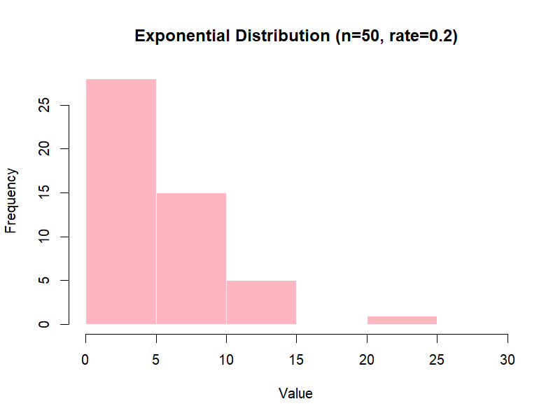

# Chapter 3 – Simple Distributions

Monte Carlo simulations rely on probability distributions to model uncertainty.  
In this chapter, we review four common distributions used in GMP & Pharma applications, with visual examples.

---

## 📊 1. Uniform Distribution

- **Definition:** All values in a given range have the same probability.
- **Parameters:** `a` = minimum, `b` = maximum.
- **R Example:**
  ```r
  runif(5, min = 40, max = 60)  # 5 values between 40 and 60
  ```
- **Use in Pharma:** Modeling tolerance bands where all outcomes within limits are equally likely.

<p align="center">  </p>

---

## 📊 2. Normal Distribution

- **Definition:** The famous bell curve, symmetric around the mean.
- **Parameters:** `μ` = mean, `σ` = standard deviation.

- **R Example:**
 ```r
rnorm(5, mean = 0, sd = 1)  # 5 standard normal values
```
- **Use in Pharma:** Measurement errors, assay results, tablet weights.

<p align="center">  </p>

---

## 📊 3. Exponential Distribution

- **Definition:** Models the time between independent events.
- **Parameter:** `λ` = rate (events per time unit).

- **R Example:**
```r
rexp(5, rate = 1)  # 5 exponential values with λ = 1
```
- **Use in Pharma:** Time to microbial contamination, equipment failure.

<p align="center">  </p>

---

## 📊 4. Triangular Distribution

- **Definition:** Defined by a minimum `a`, a maximum `b`, and a most likely value `c`.

- **R Example** (using triangle package):
```r
library(triangle)
rtriangle(5, a = 0, b = 3, c = 1)
```
- **Use in Pharma:** When only expert estimates (min, most likely, max) are available.

<p align="center">  </p>

---

## 💊 Why Distributions Matter in GMP
Choosing the right distribution ensures that simulated data reflect real-world processes.
Using the wrong one can lead to misleading conclusions, especially in **risk assessment** and **capability analysis**.

---
[← Previous: Random Numbers vs. Random Variates](chapter02_random-variates.md) | [▲ back to top](../#table-of-contents) | [Next → The Transfer Equation](chapter04_transfer-equation.md)
