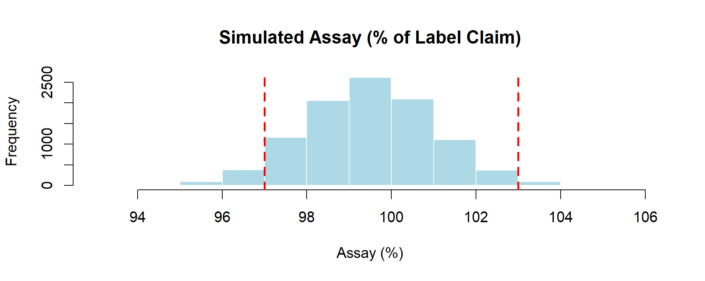

# Chapter 4 — The Transfer Equation (Model)

Monte Carlo simulations need a way to connect **random inputs** to the **output** we want to study.  
This connection is expressed mathematically by the **transfer equation**.

---

## 🔗 What is the Transfer Equation?

- **Definition:** A mathematical formula (or algorithm) that transforms one or more input variables into the output of interest.
- **Purpose:** It represents how the real-world process works, including uncertainty in inputs.

**Generic Form:**
`Output = f(Input₁, Input₂, ..., Inputₙ)`

---

## 📦 Example in GMP & Pharma

Suppose we want to simulate the **assay** of an active ingredient in a tablet:

- `API_weight` → random variable (mg per tablet)
- `Purity` → random variable (fraction)
- `Label_Claim` → constant (mg declared on the product label)

**Practical note — Purity as % vs fraction**
In QC practice, **Purity** is typically reported as a **percentage** (e.g., 99.2%).
In the transfer equation, however, it is convenient to use Purity as a **fraction** (e.g., 0.992) and multiply by 100 only at the end to express **Assay (%)**.
To avoid confusion, we explicitly state that Purity is handled as a fraction inside the model.

**Transfer Equation:**
`Assay (%) = (API_weight × Purity / Label_Claim) × 100`

> ⚠️ **Note on terminology — Assay vs. Content**  
> In pharmacopoeias such as USP and Ph. Eur., the result of this calculation may be reported either as **assay** or as **content**.  
> Both terms refer to the quantitative determination of the active ingredient, usually expressed as a **percentage of the label claim**.  
>   
> However, to avoid confusion with **content uniformity** (USP <905>), which is a different test assessing unit-to-unit variability,  
> this book consistently uses the term **assay (% of label claim)**.

---

## 💻 Example in R

```r
set.seed(123)

n <- 10000
Label_Claim <- 100          # mg declared on the product label

# 1. Random inputs
API_weight <- rnorm(n, mean = 100, sd = 1.5)    # mg of API per tablet
Purity     <- rnorm(n, mean = 0.995, sd = 0.002) # fraction purity
Purity[Purity > 1]  <- 1       # clamp unrealistic >100%
Purity[Purity < 0.98] <- 0.98  # clamp unrealistic <98%

# 2. Transfer equation: % of label claim
Assay <- (API_weight * Purity / Label_Claim) * 100

# 3. Output analysis
hist(Assay,
     main = "Simulated Assay (% of Label Claim)",
     xlab = "Assay (%)",
     col = "lightblue", border = "white")
abline(v = c(97, 103), col = "red", lwd = 2, lty = 2)  # specification limits
```
As shown in Figure 4.1, the simulated assay distribution is centered close to the target value, with natural variability leading to occasional values outside the specification limits (97–103%). This illustrates how the transfer equation connects random inputs to a realistic process output.

<p align="center">
  
  <br>
  <em>Figure 4.1 – Histogram of 10,000 simulated assay values (Transfer Equation model), with specification limits 97–103%</em>
</p>

> 🔎 **Note on "Label Claim" vs. "% w/w in Tablet"**  
> In pharmaceutical QC, *assay* is normally expressed as a percentage of the **label claim** —  
> i.e., how much active ingredient is measured compared to the amount declared on the product label (e.g., 100 mg).  
> This is why specifications are usually written as *97.0–103.0% of label claim*.  

By contrast, the ratio `(API_weight / Tablet_weight) × 100` gives the **% w/w in the tablet** (here ~40%).  
While correct mathematically, it does not correspond to regulatory assay specifications.  
For this reason, the transfer equation in this example uses **label claim** in the denominator.

---

## 💊 Why It Matters in Pharma

- The transfer equation defines **the model** — a wrong equation = wrong simulation.
- It helps identify **which input contributes most** to variability (sensitivity analysis).
- Essential in **process validation**, **robustness studies**, and **risk assessment**.

---
[← Previous: Simple Distributions](chapter03_distributions.md) | [▲ back to top](../#table-of-contents) | [Next → A Complete Simulation in R](chapter05_full-simulation.md)
