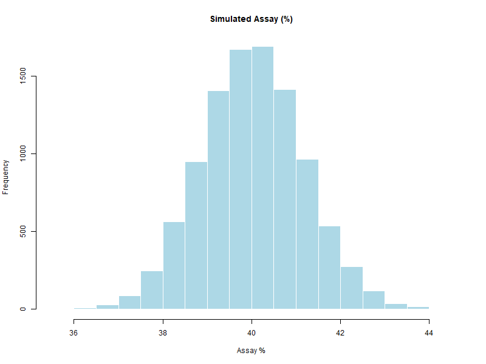

# Chapter 4 — The Transfer Equation (Model)

Monte Carlo simulations need a way to connect **random inputs** to the **output** we want to study.  
This connection is expressed mathematically by the **transfer equation**.

---

## 🔗 What is the Transfer Equation?

- **Definition:** A mathematical formula (or algorithm) that transforms one or more input variables into the output of interest.
- **Purpose:** It represents how the real-world process works, including uncertainty in inputs.

**Generic Form:**
`Output = f(Input₁, Input₂, ..., Inputₙ)`

---

## 📦 Example in GMP & Pharma

Suppose we want to simulate the **assay** of an active ingredient in a tablet:

- `API_weight` → random variable (mg)
- `Tablet_weight` → random variable (mg)
- `Purity` → random variable (fraction)

**Transfer Equation:**
`Assay (%) = (API_weight / Tablet_weight) × Purity × 100`

---

## 💻 Example in R

```r
set.seed(123)

# 1. Random inputs
API_weight     <- rnorm(10000, mean = 101, sd = 2)   # mg
Tablet_weight  <- rnorm(10000, mean = 250, sd = 5)   # mg
Purity         <- runif(10000, min = 0.98, max = 1.00)

# 2. Transfer equation
Assay <- (API_weight / Tablet_weight) * Purity * 100

# 3. Output analysis
hist(Assay, main = "Simulated Assay (%)", xlab = "Assay %")
```
<p align="center">  </p>

---

## 💊 Why It Matters in Pharma
- The transfer equation defines **the model** — a wrong equation = wrong simulation.

- It helps identify **which input contributes most** to variability (sensitivity analysis).

- Essential in **process validation**, **robustness studies**, and **risk assessment**.

---
[← Previous: Simple Distributions](chapter03_distributions.md) | [▲ back to top](../#table-of-contents) | [Next → A Complete Simulation in R](chapter05_full-simulation.md)
