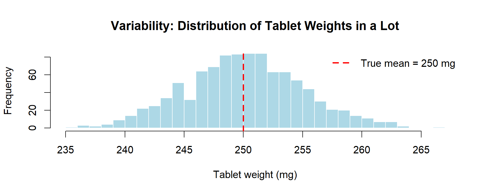
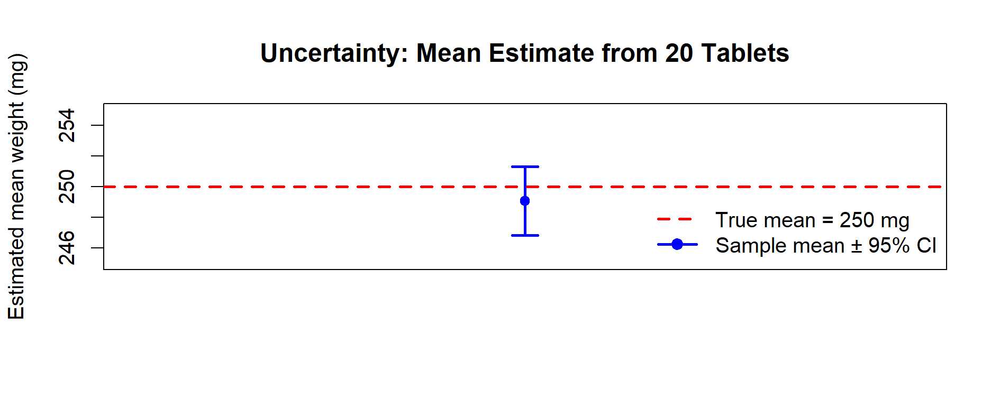

# Chapter 5 – A Complete Simulation in R

In the previous chapter we introduced the concept of the **transfer equation** and showed how inputs and outputs can be mathematically linked. That was a first illustrative step, sufficient to understand the logic but intentionally limited in scope.

Now we take a real leap forward: in this chapter we combine **random variates**, **input distributions**, and the **transfer equation** into a **complete Monte Carlo simulation**. This is the first full example, where we do not only define the model but also generate thousands of realizations, visualize the results, and interpret them in terms of pharmaceutical specifications.

---

### 📦 Variability vs Uncertainty – A Practical Illustration

Before running our first complete Monte Carlo simulation, it is useful to clarify the difference between **variability** and **uncertainty** with a simple visual experiment.

#### Example in R

```r

set.seed(123)

# --- Variability: tablet weights from a given process ---
true_mean <- 250     # mg
true_sd   <- 5       # mg
n_lot     <- 1000    # tablets in a lot

# Simulated lot: represents intrinsic variability
lot_weights <- rnorm(n_lot, mean = true_mean, sd = true_sd)

# --- Uncertainty: estimating the mean from a small sample ---
n_sample <- 20
sample_weights <- sample(lot_weights, n_sample)

mean_est <- mean(sample_weights)
sd_est   <- sd(sample_weights)

# Confidence interval for the true mean (uncertainty in estimation)
ci <- t.test(sample_weights)$conf.int

list(
  estimated_mean = mean_est,
  estimated_sd   = sd_est,
  CI_for_mean    = ci
)

# --- Plot 1: Variability (histogram of lot weights) ---
hist(lot_weights,
     breaks = 30,
     col = "lightblue",
     border = "white",
     main = "Variability: Distribution of Tablet Weights in a Lot",
     xlab = "Tablet weight (mg)")
abline(v = true_mean, col = "red", lwd = 2, lty = 2)
legend("topright", legend = c("True mean = 250 mg"),
       col = "red", lty = 2, lwd = 2, bty = "n")

# --- Plot 2: Uncertainty (sample mean with 95% CI) ---
plot(1, mean_est,
     ylim = c(true_mean - 5, true_mean + 5),   # margine più ampio
     pch = 19, col = "blue",
     xlab = "", ylab = "Estimated mean weight (mg)",
     xaxt = "n",
     main = "Uncertainty: Mean Estimate from 20 Tablets")

arrows(1, ci[1], 1, ci[2],
       angle = 90, code = 3, length = 0.1,
       col = "blue", lwd = 2)

abline(h = true_mean, col = "red", lwd = 2, lty = 2)

legend("bottomright",
       legend = c("True mean = 250 mg", "Sample mean ± 95% CI"),
       col = c("red","blue"),
       lty = c(2,1), pch = c(NA,19),
       lwd = c(2,2), bty = "n")

```

#### Visual Output

<p align="center">
  
  <br>
  <em>Figure 5.x – Variability: distribution of tablet weights in a simulated lot (1,000 tablets). The spread around the true mean (250 mg) represents intrinsic variability of the process.</em>
</p>

<p align="center">
  
  <br>
  <em>Figure 5.y – Uncertainty: estimate of the mean from a sample of 20 tablets. The point estimate is shown with its 95% confidence interval. The dashed red line is the true mean (250 mg).</em>
</p>

#### Interpretation
- The histogram shows **variability**: how much individual tablets differ from each other in a stable process.  
- The CI plot shows **uncertainty**: how sure we are about the true mean when only a small sample is available.  

---

## 🎯 Scenario

We want to simulate the **assay** of a tablet to assess if the process meets specifications:  
**LSL = 98.0%**, **USL = 102.0%**.

Inputs:

1. `API_weight` → Normally distributed (mean = 101 mg, sd = 2 mg)  
2. `Tablet_weight` → Normally distributed (mean = 250 mg, sd = 5 mg)  
3. `Purity` → Uniform distribution (min = 0.98, max = 1.00)

Transfer Equation (normalized to the label claim = 100 mg):

`Assay(%) = (API_weight * Purity / LabelClaim) * 100`   (with LabelClaim = 100 mg)

👉 Note: `Tablet_weight` is generated here as an example of an additional variable that could be used in extended scenarios (e.g., content uniformity). In this basic example it is not directly part of the assay formula.

---

## 💻 R Code

```r
set.seed(123)

# 1) Number of simulations
N <- 10000

# 2) Random inputs (come nel tuo scenario)
API_weight    <- rnorm(N, mean = 101, sd = 2)          # raw API mass
Tablet_weight <- rnorm(N, mean = 250, sd = 5)          # not used here, but useful for extensions
Purity        <- runif(N, min = 0.98, max = 1.00)      # purity fraction

# 3) Transfer equation normalizzata al Label Claim dell'API
LabelClaim <- 100                                       # mg
Assay <- (API_weight * Purity / LabelClaim) * 100       # % respect to the Label Claim

# 4) Summary
cat("Summary of Assay %:\n")
print(summary(Assay))
cat("Standard Deviation:", sd(Assay), "\n")

# 5) Histogram + specification limits
hist(Assay,
     main = "Simulated Assay (%)",
     xlab = "Assay %",
     col = "lightblue",
     border = "white")
abline(v = c(98, 102), col = "red", lwd = 2, lty = 2)

# 6) Q-Q plot
qqnorm(Assay, main = "Q-Q Plot of Simulated Assay")
qqline(Assay, col = "red", lwd = 2)

# 7) Quantiles
qs <- quantile(Assay, probs = c(0, .25, .5, .75, 1))
IQR_val <- unname(qs[4] - qs[2])

cat(sprintf(
  "Mean=%.2f, SD=%.2f, Min=%.2f, Q1=%.2f, Median=%.2f, Q3=%.2f, IQR=%.2f, Max=%.2f, OOS=%.2f%%\n",
  mean(Assay), sd(Assay), qs[1], qs[2], qs[3], qs[4], IQR_val, qs[5], 100*mean(Assay < 98 | Assay > 102)
))

# 8) Probability of OOS
p_out <- mean(Assay < 98 | Assay > 102)
cat("Probability out of spec:", p_out, "\n")
```

---

## 📊 Expected Output
- **Histogram** with vertical red dashed lines at 98% and 102% to mark specifications.

<p align="center"> 
   
  <br>
  <em>Figure 5.1 – Histogram of simulated assay values with specification limits</em>
</p>

<p align="center"> 
   
  <br>
  <em>Figure 5.2 – Q-Q Plot of simulated assay values</em>
</p>

- **Summary of Simulation Results** (mean ≈ 100%, standard deviation, quantiles) and printed `p_out` → probability of being out of specification

| **Statistic**        | **Value** |
|----------------------|----------:|
| Mean Assay (%)       | 99.98     |
| Median Assay (%)     | 99.98     |
| SD                   | 2.06      |
| Min                  | 92.27     |
| Q1 (25th)            | 98.59     |
| Q3 (75th)            | 101.38    |
| IQR                  | 2.79      |
| Max                  | 107.87    |
| Probability OOS      | 33.58%    |

> **Note:** Exact numbers may vary slightly due to random simulation,  
> but results are reproducible with the fixed seed (`set.seed(123)`).

---

## 💊 Interpretation

This simulation provides more than a single result:

- **Location**: the mean of the assay distribution is now centered around 100%, consistent with the label claim.
- **Spread**: the standard deviation quantifies the impact of input variability (API weight and purity).
- **Shape**: the Q-Q plot helps assess whether the simulated assay distribution is approximately normal.
- **Capability**: the probability of being out of specification (`p_out`) directly expresses the risk of producing tablets outside the 98–102% range.

If `p_out` is **very low** (e.g., < 0.1%), the process is highly capable.  
If `p_out` is **significant**, we may need to:
- Reduce input variability  
- Adjust process targets  
- Reduce measurement uncertainty  

👉 In GMP contexts, such probabilities (`p_out`) directly inform **risk-based decisions**: whether the process can be accepted, requires corrective actions, or must be redesigned.

*In the next chapter we will systematically analyze these results, introducing graphical summaries and capability indices to turn raw Monte Carlo output into structured GMP insights.*

---

[← Previous: The Transfer Equation](chapter04_transfer-equation.md) | [▲ back to top](../#table-of-contents) | [Next → Analysis of Results](chapter06_analysis.md)
