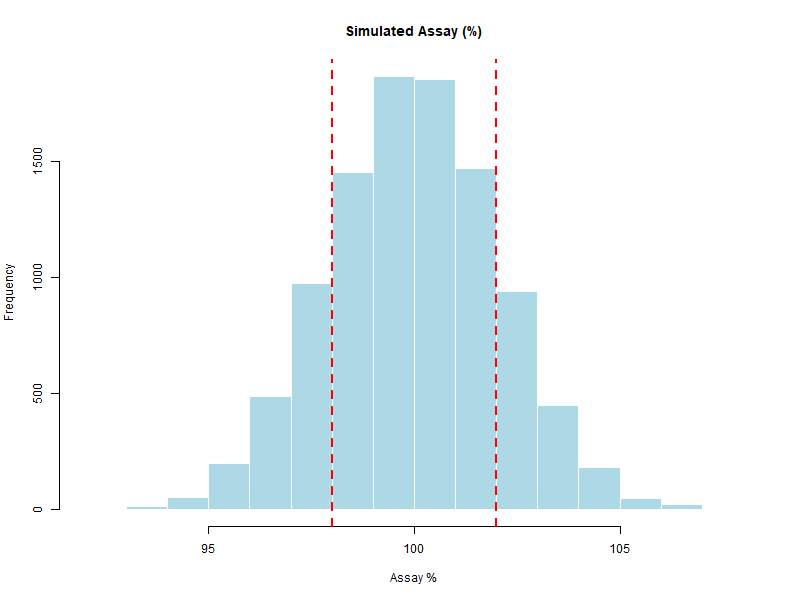

# Chapter 5 – A Complete Simulation in R

In the previous chapter we introduced the concept of the **transfer equation** and showed how inputs and outputs can be mathematically linked. That was a first illustrative step, sufficient to understand the logic but intentionally limited in scope.

Now we take a real leap forward: in this chapter we combine **random variates**, **input distributions**, and the **transfer equation** into a **complete Monte Carlo simulation**. This is the first full example, where we do not only define the model but also generate thousands of realizations, visualize the results, and interpret them in terms of pharmaceutical specifications.

---

## 🎯 Scenario

We want to simulate the **assay** of a tablet to assess if the process meets specifications:  
**LSL = 98.0%**, **USL = 102.0%**.

Inputs:

1. `API_weight` → Normally distributed (mean = 101 mg, sd = 2 mg)  
2. `Tablet_weight` → Normally distributed (mean = 250 mg, sd = 5 mg)  
3. `Purity` → Uniform distribution (min = 0.98, max = 1.00)

Transfer Equation (normalized to the label claim = 100 mg):

\[
Assay(\%) = \frac{API\_weight \times Purity}{100} \times 100
\]

`Assay(%) = (API_weight * Purity / LabelClaim) * 100`   (with LabelClaim = 100 mg)

---

## 💻 R Code

```r
set.seed(123)

# 1) Number of simulations
N <- 10000

# 2) Random inputs (come nel tuo scenario)
API_weight    <- rnorm(N, mean = 101, sd = 2)          # raw API mass
Tablet_weight <- rnorm(N, mean = 250, sd = 5)          # not used here, but useful for extensions
Purity        <- runif(N, min = 0.98, max = 1.00)      # purity fraction

# 3) Transfer equation normalizzata al Label Claim dell'API
LabelClaim <- 100                                       # mg
Assay <- (API_weight * Purity / LabelClaim) * 100       # % respect to the Label Claim

# 4) Summary
cat("Summary of Assay %:\n")
print(summary(Assay))
cat("Standard Deviation:", sd(Assay), "\n")

# 5) Histogram + specification limits
png("full_simulation_assay.png", width = 800, height = 600)
hist(Assay,
     main = "Simulated Assay (%)",
     xlab = "Assay %",
     col = "lightblue",
     border = "white")
abline(v = c(98, 102), col = "red", lwd = 2, lty = 2)
dev.off()

# 6) Q-Q plot
png("qqplot_assay.png", width = 800, height = 600)
qqnorm(Assay, main = "Q-Q Plot of Simulated Assay")
qqline(Assay, col = "red", lwd = 2)
dev.off()

# 7) Quantiles
qs <- quantile(Assay, probs = c(0, .25, .5, .75, 1))
IQR_val <- unname(qs[4] - qs[2])

cat(sprintf(
  "Mean=%.2f, SD=%.2f, Min=%.2f, Q1=%.2f, Median=%.2f, Q3=%.2f, IQR=%.2f, Max=%.2f, OOS=%.2f%%\n",
  mean(Assay), sd(Assay), qs[1], qs[2], qs[3], qs[4], IQR_val, qs[5], 100*mean(Assay < 98 | Assay > 102)
))

# 8) Probability of OOS
p_out <- mean(Assay < 98 | Assay > 102)
cat("Probability out of spec:", p_out, "\n")
```

---

## 📊 Expected Output
- **Histogram** with vertical red dashed lines at 98% and 102% to mark specifications.

<p align="center">  </p>

- **Q-Q Plot** showing whether the simulated assay distribution follows a normal shape.
<p align="center">  </p>

- **Summary of Simulation Results** (mean ≈ 100%, standard deviation, quantiles) and printed `p_out` → probability of being out of specification

| Statistic        | Value  |
|------------------|-------:|
| Mean Assay (%)   | 99.98  |
| Median Assay (%) | 99.98  |
| SD               | 2.06   |
| Min              | 92.27  |
| Q1 (25th)        | 98.59  |
| Q3 (75th)        | 101.38 |
| IQR              | 2.79   |
| Max              | 107.87 |
| Probability OOS  | 33.58% |

---

## 💊 Interpretation

This simulation provides more than a single result:

- **Location**: the mean of the assay distribution is now centered around 100%, consistent with the label claim.
- **Spread**: the standard deviation quantifies the impact of input variability (API weight and purity).
- **Shape**: the Q-Q plot helps assess whether the simulated assay distribution is approximately normal.
- **Capability**: the probability of being out of specification (p_out) directly expresses the risk of producing tablets outside the 98–102% range.

If `p_out` is **very low** (e.g., < 0.1%), the process is highly capable.

If `p_out` is **significant**, we may need to:

- Reduce input variability,
- Adjust process targets,
- Improve measurement accuracy
- This is exactly the type of insight we gain from Monte Carlo: the direct estimation of risk (% OOS).

*In the next chapter we will see how to analyze these results more systematically, turning raw simulation outputs into structured capability assessments.*

---

[← Previous: The Transfer Equation](chapter04_transfer-equation.md) | [▲ back to top](../#table-of-contents) | [Next → Analysis of Results](chapter06_analysis.md)
