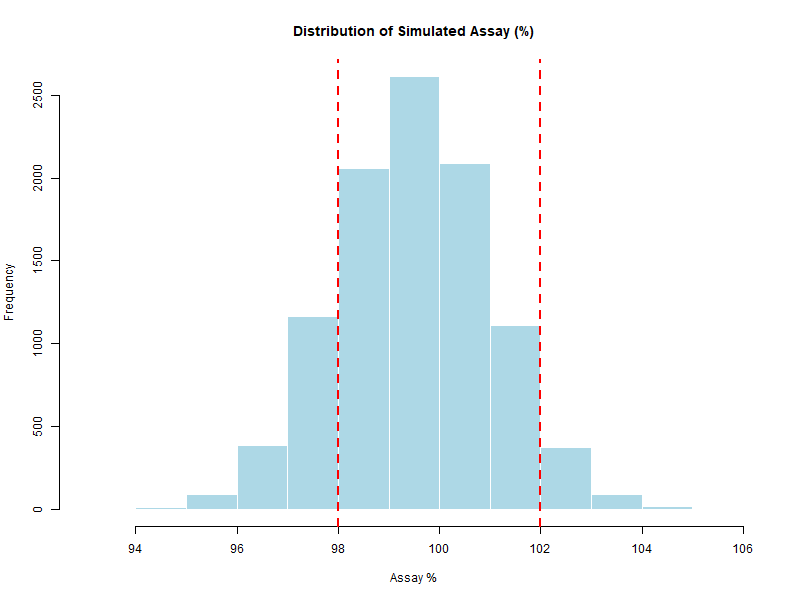
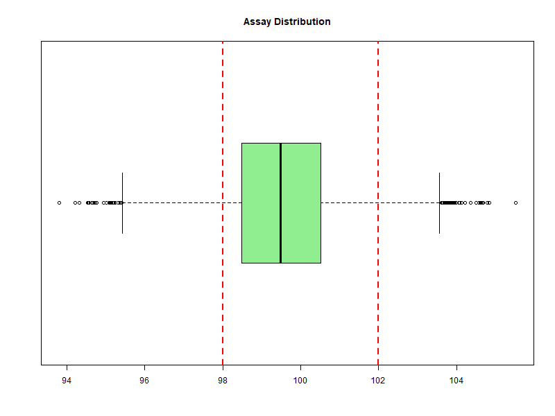

# Chapter 6 – Analysis of Results

In this chapter we systematically analyze the **10,000 simulated assay results** generated in Chapter 5.  
We use **descriptive statistics, probability of out-of-specification (OOS) results, visual tools, and capability indices**.  
Together, these methods link Monte Carlo outputs to **structured GMP decision-making**.
This allows us to assess compliance with specifications, estimate process capability, and evaluate risks.

---

## 📊 1. Descriptive Statistics

Key metrics to summarize the simulation output:

- **Mean** → central tendency.
- **Standard deviation (SD)** → variability.
- **Minimum / Maximum** → extreme values.
- **Percentiles** → distribution shape and spread.
  - **Interquartile Range (IQR)** → spread of the middle 50% of values.

**R Example:**
```r
summary(Assay)
sd(Assay)
IQR(Assay)
quantile(Assay, probs = c(0.05, 0.95))
```

**95% CI for the Mean**

```r
t.test(Assay)$conf.int
```

**Summary of simulated assay results (N = 10,000 simulations):**

| Statistic               | Value        |
|--------------------------|-------------:|
| Sample Size (N)          | 10,000       |
| Minimum                  | 93.80        |
| 1st Quartile (Q1)        | 98.48        |
| Median                   | 99.49        |
| Mean                     | 99.49        |
| 3rd Quartile (Q3)        | 100.52       |
| Maximum                  | 105.51       |
| Standard Deviation (SD)  | 1.50         |
| Interquartile Range (IQR)| 2.04         |
| 5th Percentile           | 97.03        |
| 95th Percentile          | 101.97       |
| 95% CI for Mean          | [99.46 ; 99.52] |

These results confirm that the simulated assay distribution is centered close to the target (≈ 100%),  
with moderate variability (SD ≈ 1.5%).  
The specification limits (98–102%) correspond approximately to ±1.0σ and ±1.7σ from the mean,  
which explains the relatively high probability of out-of-specification results observed later.

---

## 📉 2. Probability of Out-of-Spec (OOS)
The main GMP-related question is often: *"What is the probability that a batch is OOS?"*

**R Example:**

```r
p_out <- mean(Assay < 98 | Assay > 102)
p_out
```

If `p_out` is small (e.g., < 0.1%), the process is considered highly capable.
In our simulation, however, the estimated probability of an out-of-specification result is:

**p_out = 0.2125 (≈ 21%)**

This is a relatively high probability, indicating that about 1 in 5 simulated units fall outside the specification range (98–102%).  
Such a high OOS rate is consistent with the low capability index (Cpk ≈ 0.33) calculated later.

**Confidence Interval (95%) for p_out**

For a more robust assessment, we can estimate a 95% confidence interval for `p_out` using the `prop.test` function, which provides a score-based CI (Wilson interval).
Alternatively, confidence intervals for `p_out` can also be estimated using **bootstrap resampling**.  
This method is particularly useful when analyzing **real experimental data**, where the distribution is not well described by simple binomial assumptions.  
In Monte Carlo simulations, however, the number of simulated data points can be arbitrarily large, so the binomial approximation is usually sufficient.

```r
N <- length(Assay)
x <- sum(Assay < 98 | Assay > 102)
prop.test(x, N)$conf.int
```

⚠️ **Important note on interpretation of OOS confidence intervals**

There is a fundamental difference between two contexts:

- **Case 1: Monte Carlo simulation**  
  In a simulation we generate as many virtual observations as we want, based on assumed probability models (Normal, Uniform, Triangular, etc.).  
  The probability of OOS can be estimated directly as the relative frequency:  
  ```r
  p_out <- mean(Assay < 98 | Assay > 102)
  ```
  With large simulated samples (e.g., 100,000), this estimate is already very precise.
  **Binomial confidence intervals** are not required here, because the probability is derived directly from the model.

- **Case 2: Real experimental data (non-simulated)**
  When analyzing actual samples from production or laboratory experiments, the number of OOS results is a discrete count out of n units tested.
  This situation follows a **Binomial(n, p)** model, where each unit is either in-spec or OOS.
  In this case, confidence intervals for the true OOS probability p are essential, and can be computed with:
  - **Clopper–Pearson exact interval** (conservative, guarantees at least 95% coverage).
  - **Wilson (score) interval** (less conservative and widely recommended).
  - `prop.test()` **in R**, which implements the Wilson score-based CI by default.

Example:
```r
N <- length(Assay)               # number of observations
x <- sum(Assay < 98 | Assay > 102)  # number of OOS
prop.test(x, N)$conf.int
```

👉 In practice:
    - For **Monte Carlo outputs**, the simulation itself provides a precise estimate.
    - For **real GMP data**, binomial confidence intervals (Clopper–Pearson, Wilson) or bootstrap resampling are necessary to quantify uncertainty from limited         sample size.
  
---

## 📈 3. Visualizing the Distribution
Graphs make interpretation easier:

- **Histogram** for the overall shape.

- **Boxplot** to detect skewness and outliers.

- **Empirical cumulative distribution function (ECDF)** to directly read probabilities.

**R Example:**

```r
hist(Assay,
     main = "Distribution of Simulated Assay (%)",
     xlab = "Assay %",
     col = "lightblue",
     border = "white")
abline(v = c(98, 102), col = "red", lwd = 2, lty = 2)

boxplot(Assay, horizontal = TRUE,
        main = "Assay Distribution",
        col = "lightgreen")
abline(v = c(98, 102), col = "red", lwd = 2, lty = 2)

plot(ecdf(Assay),
     main = "Empirical CDF of Assay",
     xlab = "Assay %",
     ylab = "Cumulative probability")
abline(v = c(98, 102), col = "red", lwd = 2, lty = 2)
```

<p align="center">
  
  <br>
  <em>Figure 6.1 – Histogram of simulated assay values with specification limits (98–102%).</em>
</p>

<p align="center">
  
  <br>
  <em>Figure 6.2 – Boxplot of simulated assay values with specification limits (98–102%).</em>
</p>

<p align="center">
  
  <br>
  <em>Figure 6.3 – Empirical CDF of simulated assay values with specification limits (98–102%).</em>
</p>

---

## 📐 4. Capability Indices
For normally distributed data:

$$
Cpk = \min \left( \frac{USL - \mu}{3\sigma}, \frac{\mu - LSL}{3\sigma} \right)
$$

`Cpk = min( (USL - μ)/(3*σ), (μ - LSL)/(3*σ) )`

*Note: the closed-form Cpk formula assumes approximate normality and a symmetric distribution.  
For non-normal data, consider transformations or **percentile-based capability indices**, which Monte Carlo can estimate directly.*

**R Example:**

```r
mean_assay <- mean(Assay)
sd_assay   <- sd(Assay)
USL <- 102
LSL <- 98

Cpk <- min((USL - mean_assay) / (3 * sd_assay),
           (mean_assay - LSL) / (3 * sd_assay))
Cpk
```

**Result:**  
For the simulated assay data, the capability index is:

Cpk = 0.33  

This value is far below the usual GMP threshold (Cpk ≥ 1.33),  
confirming that the process, as simulated, has insufficient capability  
to consistently remain within the 98–102% specification limits.  
The low Cpk is coherent with the relatively high probability of OOS (≈ 21%).

---

## 💊 GMP Interpretation

- **Low p_out + High Cpk** → process under good control, with high confidence in consistent GMP compliance.  
- **High p_out or Low Cpk** → potential quality risk; these indicators should trigger investigation or corrective actions.  

Visual tools and numerical metrics, **together**, provide the clearest and most reliable basis for decision-making.  

👉 This structured analysis bridges raw simulation output with **regulatory decision-making**, preparing the ground for the real-world pharmaceutical case study in the next chapter.

---
[← Previous: A Complete Simulation in R](chapter05_full-simulation.md) | [▲ back to top](../#table-of-contents) | [Next → Pharmaceutical Case Study](chapter07_case-pharma.md)
