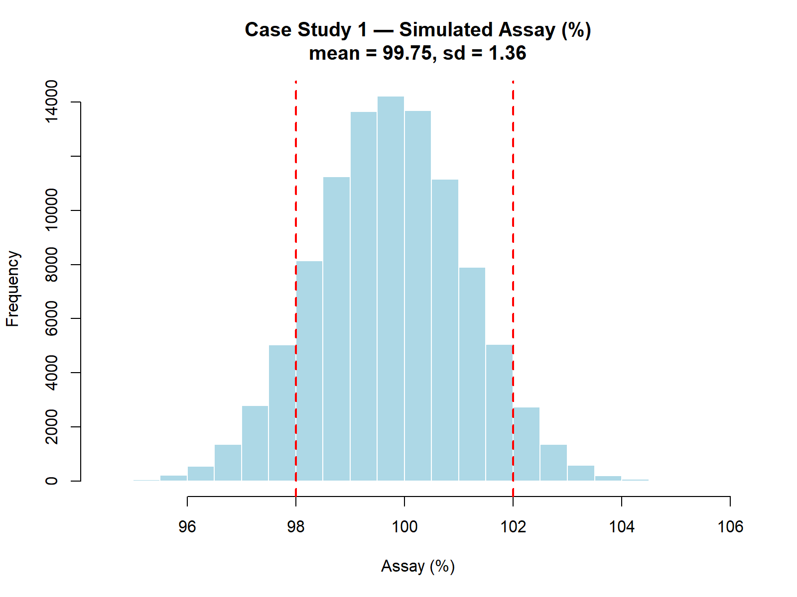
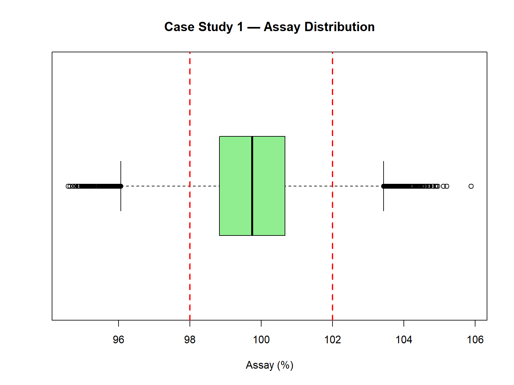
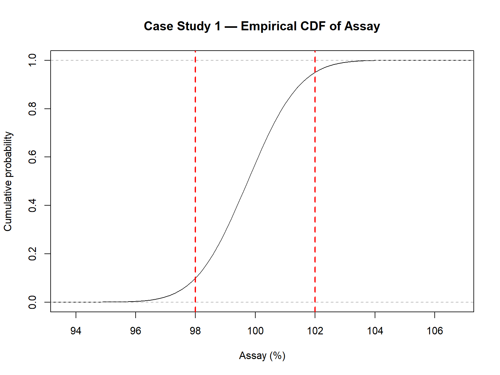
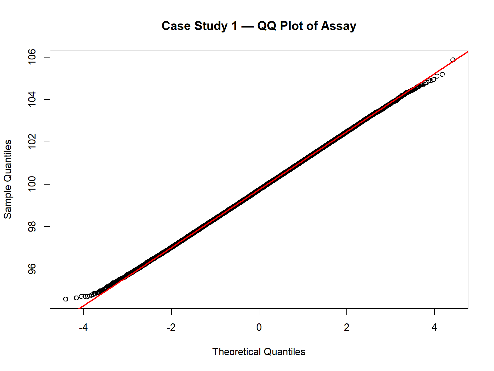

# Chapter 7 — Case Study 1 — API Assay in Tablets

In this chapter, we present a realistic **GMP pharmaceutical example** to demonstrate the complete Monte Carlo workflow — from defining inputs to interpreting results.

---

## 💊 Scenario: Assay of an API in Finished Tablets

A Quality Control laboratory is validating a new process for producing tablets containing an Active Pharmaceutical Ingredient (API).  
The target assay is **100.0%** with specifications:  
- **LSL = 98.0%**  
- **USL = 102.0%**

---

## 📥 Step 1 – Define Inputs and Distributions

Based on historical data and expert estimates:

| Input Variable        | Distribution  | Parameters                  | Source                  |
|-----------------------|--------------|-----------------------------|-------------------------|
| API Weight (mg)       | Normal       | mean = 100.5, sd = 1.2      | Production data         |
| API Label Claim (mg)  | Normal       | mean = 100.0, sd = 0.5      | Production data         |
| Purity (fraction)     | Uniform      | min = 0.985, max = 1.00     | Certificate of Analysis |

*Note: “API Label Claim” refers to the **declared API content (mg)**, not the total tablet mass.*

---

## 🔗 Step 2 – Define the Transfer Equation

The assay is calculated using the ratio of API weight to API label claim, multiplied by purity and converted to a percentage:

Assay(%) = (`API_weight` / `API_LabelClaim`) * `Purity` * 100

---
*Note: “API Label Claim” represents the declared API content per tablet (mg), 
used as the denominator in the transfer equation. It does not refer to the total tablet mass.*

## 💻 Step 3 – Run the Simulation in R

```r
set.seed(123)

# Number of simulations
N <- 100000

# NOTE ON VARIABLES:
# - API_weight: measured API content per tablet (mg)
# - API_LabelClaim: declared API content (mg), not total tablet mass
# - Purity: assay purity (fraction), used as correction factor

# 1) Random inputs (choose realistic values so that assay ~ 100%)
API_weight    <- rnorm(N, mean = 100.5, sd = 1.2)  # mg measured API
API_LabelClaim <- rnorm(N, mean = 100.0, sd = 0.5)  # mg label claim (API)
Purity        <- runif(N, min = 0.985, max = 1.000)

# 2) Transfer equation
Assay <- (API_weight / API_LabelClaim) * Purity * 100

# Quick sanity-check on center and spread
mean_assay <- mean(Assay)
sd_assay   <- sd(Assay)

# 3) Histogram with specs
hist(Assay, 
     main = sprintf("Case Study 1 — Simulated Assay (%%) — mean=%.2f, sd=%.2f", mean_assay, sd_assay),
     xlab = "Assay (%)",
     col = "lightblue",
     border = "white")
abline(v = c(98, 102), col = "red", lwd = 2, lty = 2)

# 4) Boxplot
boxplot(Assay, horizontal = TRUE,
        main = "Case Study 1 — Assay Distribution",
        col = "lightgreen")
abline(v = c(98, 102), col = "red", lwd = 2, lty = 2)

# 5) ECDF
plot(ecdf(Assay),
     main = "Case Study 1 — Empirical CDF of Assay",
     xlab = "Assay (%)",
     ylab = "Cumulative probability")
abline(v = c(98, 102), col = "red", lwd = 2, lty = 2)

# 6) QQ plot for normality check
qqnorm(Assay, main = "Case Study 1 — QQ Plot of Assay")
qqline(Assay, col = "red", lwd = 2)

# 7) Probability of OOS
p_out <- mean(Assay < 98 | Assay > 102)

# 8) Capability index vs 98–102 (normality assumption)
USL <- 102; LSL <- 98
Cpk <- min((USL - mean_assay) / (3 * sd_assay),
           (mean_assay - LSL) / (3 * sd_assay))

list(mean_assay = mean_assay, sd_assay = sd_assay, p_out = p_out, Cpk = Cpk)
```

---

## 📊 Step 4 – Example Output

- **Histogram** with red dashed lines marking specification limits.
- **Observed results** for this simulation:
  - Mean assay: 99.75%
  - Standard deviation: 1.36%
  - Probability of OOS (`p_out`): 14.95%
  - **Cpk**: ≈ 0.43 → far below the GMP-recommended threshold of 1.33

**Summary of simulated assay results (N = 100,000):**

| Statistic               | Value        |
|--------------------------|-------------:|
| Mean                     | 99.75        |
| Standard Deviation       | 1.36         |
| 5th Percentile           | 97.53        |
| 95th Percentile          | 101.96       |
| Minimum (simulated)      | 95.01        |
| Maximum (simulated)      | 104.56       |
| Probability of OOS       | 14.95%       |
| Capability Index (Cpk)   | 0.43         |

These values indicate a process with **excessive variability** and a **non-negligible risk** of producing batches outside specifications.

> **Note:** This dataset was chosen **deliberately** to illustrate how Monte Carlo simulations can reveal a process that is **not in control**.  
> In a real GMP context, results like these would trigger a root cause investigation and corrective actions to reduce variability and improve process centering.

<p align="center">  </p>

<p align="center">  </p>

<p align="center">  </p>

<p align="center">  </p>

---

Cpk was calculated as:

$$
Cpk = \min \left( \frac{USL - \mu}{3\sigma}, \frac{\mu - LSL}{3\sigma} \right)
$$

`Cpk = min( (USL - μ)/(3*σ), (μ - LSL)/(3*σ) )`

---

*Note: The closed-form Cpk assumes approximate normality. For skewed or non-normal data, percentile-based indices or Monte Carlo percentiles are more robust.*
*In GMP reports, it is often recommended to present both **parametric indices** (like Cpk) and **percentile-based indices**,  
to ensure robustness against deviations from normality.*

## 📌 Step 5 – GMP Interpretation

- **High p_out** (~15%): significant risk of non-compliance.
- **Low Cpk** (~0.43): process poorly centered and/or with high variability.
- Immediate corrective and preventive actions (CAPA) would be needed before routine production.

> **Reminder:** Unlike the “ideal” scenarios shown earlier (low p_out, high Cpk),  
> this case study was selected to demonstrate how Monte Carlo simulation can **highlight an at-risk process** and guide GMP decision-making.

This approach can be extended to future case studies, such as:
- Dissolution testing
- Content uniformity
- Stability data projections
- Microbiological limits

This quantitative approach supports risk-based decision-making and can be documented in validation or continued process verification reports.

---

## 🔄 Step 6 – What-if Scenario (Process Improvement)

Suppose variability of API weight is reduced from **sd = 1.2 mg → sd = 0.8 mg**  
(e.g., by better control of blending and compression).

**Re-running the simulation (after process improvement, N = 100,000) yields:**

| Statistic               | Value        |
|--------------------------|-------------:|
| Mean                     | 99.75        |
| Standard Deviation (SD)  | 0.93         |
| Probability of OOS       | 5.0%         |
| Capability Index (Cpk)   | 0.63         |

**Comparison: Before vs After Process Improvement**

| Statistic               | Before (sd=1.2 mg) | After (sd=0.8 mg) |
|--------------------------|-------------------:|------------------:|
| Mean                     | 99.75              | 99.75             |
| Standard Deviation (SD)  | 1.36               | 0.93              |
| Probability of OOS       | 14.95%             | 5.0%              |
| Capability Index (Cpk)   | 0.43               | 0.63              |

This demonstrates how Monte Carlo can quantify the **benefit of CAPA actions**,  
providing objective evidence that process improvements **significantly** reduce the risk of non-compliance.

> 🔎 **Regulatory Note:**  
> This type of Monte Carlo analysis aligns with the **ICH Q9(R1) principles of risk management**,  
> and can support documentation in **Process Validation Stage 3 (Continued Process Verification)**  
> as recommended in FDA and EMA guidelines.

---
These results illustrate how Monte Carlo simulation provides not only descriptive statistics,  
but also **probabilistic evidence of compliance risk**,  
which can be directly incorporated into GMP decision-making and regulatory documentation.
*In the next chapter, we expand this perspective by showing how simulation results  
can systematically support decision-making and risk management in GMP contexts.*


[← Previous: Analysis of Results](chapter06_analysis.md) | [▲ back to top](../#table-of-contents) | [Next → Decision and Risk](chapter08_decision-risk.md)
