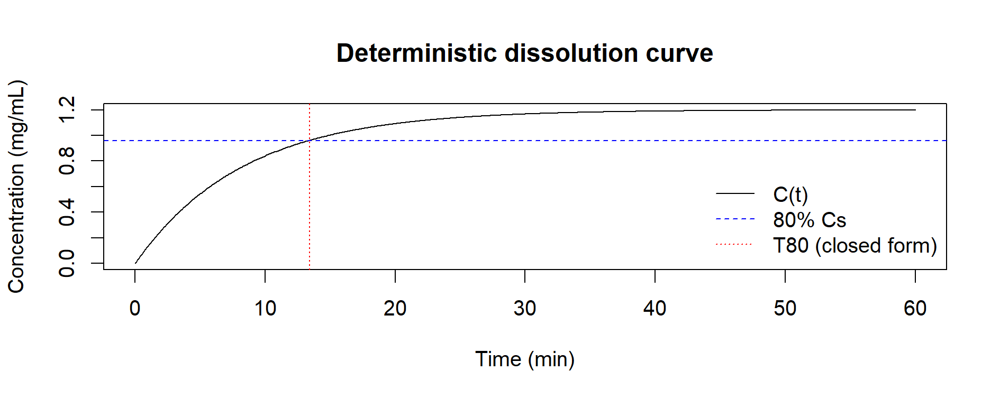
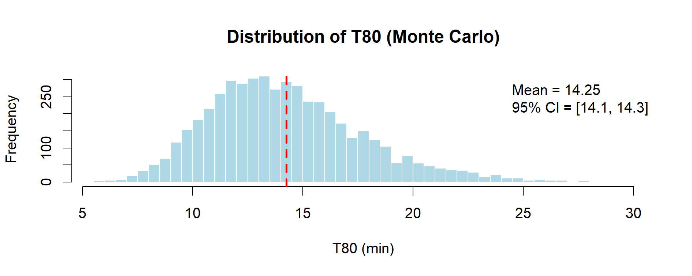
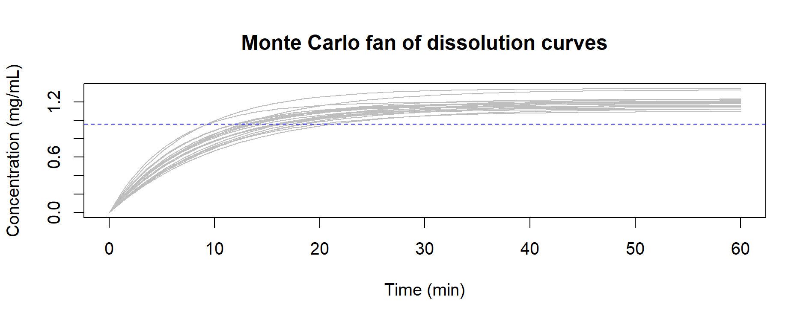

# Chapter 8 — Case Study 2 — Dissolution with Noyes–Whitney Law

In this chapter, we illustrate how Monte Carlo methods can be applied to **dissolution testing**,  
a critical parameter in pharmaceutical development and quality control.

We contrast:
- a **deterministic simulation** of the dissolution curve using the Noyes–Whitney law, and  
- a **Monte Carlo simulation** that incorporates parameter variability, producing a *distribution* of dissolution times (T80).

---

> 📌 **Monte Carlo and Two Classes of Problems**  
> As emphasized already in early texts (e.g. Hammersley & Handscomb, 1964), Monte Carlo methods can be applied to two broad classes of problems:
>
> - **Probabilistic problems**  
>   These are problems that are intrinsically random, where the Monte Carlo method simulates the underlying stochastic process.  
>   Examples: growth of insect populations, traffic in telephone exchanges, neutron diffusion in reactors.  
>
> - **Deterministic problems**  
>   These are problems that are not random in themselves, but can be reformulated in probabilistic terms.  
>   The Monte Carlo method then solves the equivalent random problem to obtain the answer to the original deterministic one.  
>   Examples: numerical solutions of differential equations such as Laplace or Schrödinger, or—here—dissolution kinetics.  
>
> This distinction remains pedagogically useful today: **Monte Carlo is not limited to probability theory**.  
> It also provides an alternative, variability-oriented lens on deterministic models, enriching their interpretation.

---

## 💊 Scenario: Dissolution Testing

Dissolution testing evaluates the rate at which an Active Pharmaceutical Ingredient (API) dissolves in a medium.  
The Noyes–Whitney law provides a simple first-order differential equation for drug concentration over time:

$$
\frac{dC}{dt} = k \cdot (C_s - C(t))
$$

Where:  
- *C(t)* = concentration at time *t*  
- *C_s* = solubility limit (mg/mL)  
- *k* = dissolution rate constant (1/min)  

A key metric is **T80**: the time required to reach 80% of solubility.

---

> 📘 **Historical Note – The Noyes–Whitney Law (1897)**  
> The Noyes–Whitney equation describes dissolution as a **first-order differential equation**.  
>
> The model assumes that the dissolution rate is proportional to the difference between saturation concentration and current concentration.  
> 
> While today more complex models exist (e.g. Nernst–Brunner, diffusion layer models), Noyes–Whitney remains:
> - mathematically simple,  
> - analytically solvable (closed-form solution exists),  
> - and therefore highly suitable for **didactic demonstration**.  
>
> In this case study, it serves as an ideal example of a *deterministic problem* (a first-order ODE with known solution)  
> that can also be explored via **Monte Carlo simulation**, showing how parameter variability leads to a distribution of outcomes.

---

## 🔗 Step 1 – Deterministic Simulation

We first simulate dissolution using fixed parameters:

- Rate constant: *k = 0.12 (1/min)*  
- Solubility: *Cs = 1.20 mg/mL*  
- Initial concentration: *C0 = 0*  
- Time horizon: 60 min

```r
# Deterministic simulation (Euler method)
k   <- 0.12      # 1/min
Cs  <- 1.20      # mg/mL
C0  <- 0         # mg/mL
t_end <- 60      # minutes
dt    <- 0.1
time  <- seq(0, t_end, by=dt)

C <- numeric(length(time))
C[1] <- C0
for (i in 2:length(time)) {
  dCdt <- k * (Cs - C[i-1])
  C[i] <- C[i-1] + dt * dCdt
}

target <- 0.80 * Cs
i_hit  <- which(C >= target)[1]
T80_closed <- log(5) / k   # closed-form check

# --- Plot the dissolution curve ---
plot(time, C,
     type = "l",
     xlab = "Time (min)",
     ylab = "Concentration (mg/mL)",
     main = "Deterministic dissolution curve")

# Add horizontal line for 80% Cs
abline(h = target, lty = 2, col = "blue")

# Add vertical line for T80 (closed form)
abline(v = T80_closed, lty = 3, col = "red")

legend("bottomright",
       legend = c("C(t)", "80% Cs", "T80 (closed form)"),
       lty = c(1, 2, 3),
       col = c("black", "blue", "red"),
       bty = "n")

```

<p align="center">
  
  <br>
  <em>Figure 8.1 – Deterministic dissolution curve using the Noyes–Whitney model (k = 0.12, Cs = 1.20 mg/mL). The dashed line marks 80% Cs, the dotted line the T80 closed-form solution.</em>
</p>

The deterministic model yields a single estimate of `T80 (≈ 13 min)`.

---

## 💻 Step 2 – Monte Carlo Simulation

In practice, dissolution parameters vary due to formulation, medium, temperature, and other experimental factors.
We model uncertainty as:

- $k \sim \text{LogNormal}(\mu=0.12, \text{CV}=25\%)$  
- $C_s \sim \text{Normal}(1.20, \, 0.05)$, truncated to positive values

We then simulate 5,000 virtual experiments.

```r
set.seed(123)
N <- 5000

# Helper to sample lognormal from mean & CV
r_lognorm_from_mean_cv <- function(n, mean, cv){
  sigma2 <- log(1 + cv^2)
  mu     <- log(mean) - 0.5*sigma2
  rlnorm(n, meanlog = mu, sdlog = sqrt(sigma2))
}

k_samp  <- r_lognorm_from_mean_cv(N, mean=0.12, cv=0.25)
Cs_raw  <- rnorm(N, mean=1.20, sd=0.05)
Cs_samp <- ifelse(Cs_raw > 0, Cs_raw, 1.20)

# Quantity of interest: T80 = ln(5)/k
T80 <- log(5) / k_samp

mean_T80 <- mean(T80)
sd_T80   <- sd(T80)
ci_T80   <- mean_T80 + c(-1,1) * qt(0.975, df=N-1) * sd_T80/sqrt(N)
p_T80_30 <- mean(T80 <= 30)

# --- Plot 1: Distribution of T80 ---
hist(T80,
     breaks = 40,
     xlab = "T80 (min)",
     main = "Distribution of T80 (Monte Carlo)",
     col = "lightblue",
     border = "white")
abline(v = mean_T80, col = "red", lwd = 2, lty = 2)
legend("topright",
       legend = c(sprintf("Mean = %.2f", mean_T80),
                  sprintf("95%% CI = [%.1f, %.1f]", ci_T80[1], ci_T80[2])),
       bty = "n")

# --- Plot 2: Fan of dissolution curves C(t) ---
time <- seq(0, 60, by = 0.5)
ns <- 20
idx <- sample(seq_len(N), ns)

matplot(time,
        sapply(idx, function(j) Cs_samp[j] * (1 - exp(-k_samp[j] * time))),
        type = "l", lty = 1, col = "gray",
        xlab = "Time (min)", ylab = "Concentration (mg/mL)",
        main = "Monte Carlo fan of dissolution curves")
abline(h = 0.8 * mean(Cs_samp), lty = 2, col = "blue")

```

---

## 📊 Step 3 – Example Output

- **Distribution of T80** across 5,000 simulations  
- **Fan of simulated curves** for 20 random parameter draws

<p align="center">
  
  <br>
  <em>Figure 8.2 – Distribution of T80 values obtained by Monte Carlo simulation (N = 5000). The variability in k leads to a spread of dissolution times, though all below 30 min.</em>
</p>

<p align="center">
  
  <br>
  <em>Figure 8.3 – Example of 20 dissolution curves simulated via Monte Carlo (random draws of k and Cs). The fan of profiles illustrates process variability around the deterministic expectation.</em>
</p>

**Summary statistics (N = 5,000):**

| Statistic                   | Value         |
|-----------------------------|--------------:|
| Mean T80 (min)              | ≈13.5         |
| Standard deviation (SD)     | ≈3.0          |
| 95% Confidence Interval for T80 (min)| ≈[7.7, 19.3] min |
| Probability T80 ≤ 30 min    | 100%          |

---

## 📌 Step 4 – GMP Interpretation

- Deterministic model → one value of T80 (13 min).  
- Monte Carlo model → distribution of T80 values, capturing uncertainty and variability.  
- Despite variability, **all simulations meet the requirement T80 ≤ 30 min**, confirming process robustness.

> **Regulatory Note:**  
> Monte Carlo analysis of dissolution is consistent with **ICH Q9(R1)** (risk management) and **USP <1210>** (simulation as supportive tool).  
> It provides a richer picture than single deterministic estimates, making risk-based decisions more transparent.

---

[← Previous: Case Study 1 — Pharmaceutical Example](chapter07_case-pharma.md) | [Next: Case Study 3 — From 3 Batches to Continuous Confidence →](chapter09_case-study3.md)
