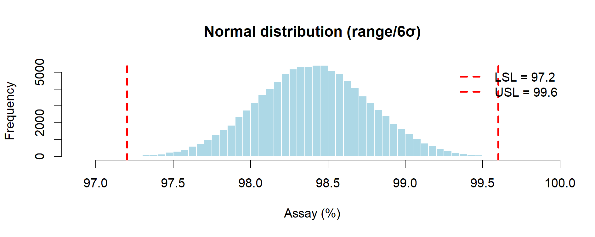

# Chapter 9 — Case Study 3 — From 3 Batches to Continuous Confidence (Monte Carlo & Bootstrap)

In this chapter, we illustrate how **Monte Carlo** and **Bootstrap** methods  
can be applied in **Process Validation (Stage 2 – PPQ)** and **Continued Process Verification (Stage 3 – CPV)**.

We contrast:
- **Monte Carlo simulation**, useful when data are scarce (e.g., only 3 PPQ lots),  
- **Bootstrap resampling**, powerful when many data points accumulate during CPV.

---

## 💊 Scenario: Process Validation and CPV

Process Validation typically proceeds in 3 stages:

1. **Process Design (Stage 1)** – defining the process.  
2. **Performance Qualification (PPQ, Stage 2)** – usually **3 conformance lots**.  
3. **Continued Process Verification (CPV, Stage 3)** – ongoing monitoring with many lots.  

⚠️ Limitation: Stage 2 has very few data points (typically 3 lots); Stage 3 has more data, but uncertainty still needs quantification.

Simulation tools provide a bridge:
- **Monte Carlo** → probabilistic estimates based on assumptions when data are minimal.  
- **Bootstrap** → empirical confidence intervals when data are available.

---

## 🔗 Step 1 – Monte Carlo with 3 PPQ Lots

Suppose a PPQ study provides 3 assay results:  
- 97.2%, 98.4%, 99.4%  

Specification limits: **LSL = 97.2, USL = 99.6**.

Since data are scarce, we explore plausible **distributional assumptions**:  
- Triangular (min, mode, max)  
- Uniform (min, max)  
- Normal (mean ± 3σ rule, using range)  

```r
###############################################################################
# Monte Carlo with 3 PPQ Batches 
# Purpose: simulate three plausible distributions (Triangular, Uniform, Normal)
#          from minimal PPQ information and visualize risk vs specs.
# Output:  prints a results table and shows three histograms on screen.
###############################################################################

## ------  USER SETTINGS: Simulation size and PPQ-derived parameters  ----------
set.seed(123)
n_sim    <- 1e5
min_val  <- 97.2
mode_val <- 98.4          # set NA if no set-point; triangular skipped
max_val  <- 99.4
LSL      <- 97.2
USL      <- 99.6
plot_on  <- TRUE
## ---------------------------------------------------------------------------

library(triangle)   # triangular sampling

## ---------- helper functions & common x-range -------------------------------
risk <- function(x) mean(x < LSL | x > USL)
cpk  <- function(x) (min(USL - mean(x), mean(x) - LSL)) / (3 * sd(x))

# single place to change axis limits if you want extra margin
x_range <- c(LSL - 0.3, USL + 0.3)   # same limits for all three plots

add_spec <- function() {
  abline(v = c(LSL, USL), col = "red", lty = 2, lwd = 2)
  legend("topright",
         legend = c(paste0("LSL = ", LSL),
                    paste0("USL = ", USL)),
         col = "red", lty = 2, lwd = 2, bty = "n")
}

results <- list()

## ------------------------ 1. Triangular -------------------------------------
if (!is.na(mode_val)) {
  x_tri <- rtriangle(n_sim, a = min_val, b = max_val, c = mode_val)
  results$Triangular <- list(summary = summary(x_tri),
                             OOS_perc = 100 * risk(x_tri),
                             Cpk      = cpk(x_tri))
  if (plot_on) {
    hist(x_tri, breaks = 60, col = "lightblue",
         main = "Triangular distribution", xlab = "Assay (%)",
         xlim = x_range)
    add_spec()
  }
}

## ------------------------ 2. Uniform ----------------------------------------
x_unif <- runif(n_sim, min_val, max_val)
results$Uniform <- list(summary = summary(x_unif),
                        OOS_perc = 100 * risk(x_unif),
                        Cpk      = cpk(x_unif))
if (plot_on) {
  hist(x_unif, breaks = 60, col = "lightblue",
       main = "Uniform distribution", xlab = "Assay (%)",
       xlim = x_range)
  add_spec()
}

## ------------------------ 3. Normal (6σ rule) -------------------------------
mu_est    <- ifelse(is.na(mode_val), mean(c(min_val, max_val)), mode_val)
sigma_est <- (max_val - min_val) / 6
x_norm    <- rnorm(n_sim, mu_est, sigma_est)

results$Normal <- list(summary = summary(x_norm),
                       OOS_perc = 100 * risk(x_norm),
                       Cpk      = cpk(x_norm))
if (plot_on) {
  hist(x_norm, breaks = 60, col = "lightblue",
       main = "Normal distribution (range/6σ)", xlab = "Assay (%)",
       xlim = x_range)
  add_spec()
}

## --------------------- 4. Console summary -----------------------------------
cat("\n===== COMPARATIVE RESULTS =====\n")
for (d in names(results)) {
  cat("\n---", d, "---\n")
  print(results[[d]]$summary)
  cat(sprintf("Simulated %%OOS : %.3f %%\n", results[[d]]$OOS_perc))
  cat(sprintf("Simulated Cpk   : %.3f\n",  results[[d]]$Cpk))
}
###############################################################################

```
<p align="center">
  
  <br>
  <em>Figure 9.1 – Triangular distribution of assay results (Monte Carlo simulation with 3 lots).</em>
</p>

<p align="center">
  
  <br>
  <em>Figure 9.2 – Uniform distribution of assay results (Monte Carlo simulation with 3 lots).</em>
</p>

<p align="center">
  
  <br>
  <em>Figure 9.3 – Normal distribution of assay results (Monte Carlo simulation with 3 lots).</em>
</p>


**Comparative Results (Monte Carlo, n = 100,000)**

| Distribution | %OOS (simulated) | Cpk (simulated) | Key Notes |
|--------------|-----------------:|----------------:|-----------|
| **Triangular** (min–mode–max) | ~0.00% | ~0.84 | Middle-of-the-road estimate; finite tails and explicit “most likely” value. Consistent with ICH Q11 guidance to use prior knowledge (target set-point + observed extremes). |
| **Uniform** (min–max)         | ~0.00% | ~0.58 | Most conservative “no-assumption” prior; assumes every value in range equally likely; depresses Cpk. Aligns with ICH Q9 expectations of caution under uncertainty.  |
| **Normal** (range/6σ rule)    | ~0.13% | ~1.09 | Infinite tails produce a small %OOS which implies non-zero failure risk; capability appears higher but relies on normality.|


**Regulatory Interpretation**

Monte Carlo simulation addresses the statistical fragility of Stage 2 PPQ, where only three batches are available. Under such small n, classical confidence intervals are essentially uninformative (e.g. zero failures in 3 lots still allows a 63.2% upper bound on true failure rate).  

By contrast, simulation enables risk-based language that resonates with **ICH Q9(R1) Quality Risk Management** and **USP <1210> Statistical Tools for Validation**:  

- **Uniform distribution**: pessimistic by construction. Because all values between 97.2 and 99.4 are treated as equally likely, the variance is inflated and Cpk is depressed. Risk of OOS remains zero since the simulated range lies fully within the specification window.
Relies on a transparent, conservative assumption when only min–max values are known. Regulators will recognize this as a cautious “worst-case” scenario  

- **Triangular distribution**: concentrates probability near the set-point (98.4%) while retaining finite tails. It yields intermediate estimates and is usually the most defensible when a credible target value is known.
It is defensible when development knowledge or a target set-point exists, as encouraged by **ICH Q11** on development models.  

- **Normal distribution**: extrapolates beyond observed min–max, producing a small but non-zero OOS fraction (≈0.13%) and a higher Cpk. This model is analytically convenient but may understate risk if physical or process limits prevent values outside the observed range.
Normal distribution links naturally to Cp/Cpk metrics commonly cited in inspection reports, but its assumption of infinite tails must be explicitly acknowledged to avoid over-optimism.

**Take-home message:**  
Monte Carlo simulation converts the fragile evidence of three PPQ batches into quantitative, inspection-ready statements of risk. It highlights that conclusions depend less on the arithmetic of three numbers and more on the assumptions we are willing to defend.  

- If no process knowledge exists → the **uniform** prior is the most neutral.  
- If a credible set-point is known → the **triangular** prior is usually preferred.  
- If one wants a link with Cp/Cpk formulas or prediction intervals → a **normal** prior can be justified, but its infinite tails must be explicitly acknowledged.

This structured comparison bridges the Stage 2 “data gap” and provides a probabilistic view of future performance that classical statistics cannot deliver with n = 3.

**Key message for inspectors and QA reviewers:**  
Monte Carlo does not replace the three-lot requirement, but it **quantifies the predictive risk** that those three lots represent. Instead of asserting “all three lots passed,” one can state, for example:  

> “Based on available evidence, the predicted long-run risk of an out-of-specification lot is ≤ 0.2%, with a provisional Cpk of ~0.8–1.1 depending on the distributional assumption.”  

Such statements are aligned with the lifecycle paradigm of **FDA Process Validation Guidance (2011)** and **ICH Q8–Q12**, where the burden is to provide *science-based, quantitative evidence* of control, even in early PPQ.

&nbsp;

---

&nbsp;

## 💻 Step 2 – Bootstrap with 23 Lots (PPQ + CPV)

Now suppose more data accumulate:
- 3 PPQ batches  
- +20 commercial lots (total = 23)

This allows **resampling from the data themselves**.

&nbsp;

> 📦 **Where Bootstrap fits among Monte Carlo methods**
>
> Bootstrap resampling is itself a **Monte Carlo technique**:  
> instead of sampling from a theoretical distribution (as in “classical” Monte Carlo),
> it draws random samples **with replacement** from the observed data.  
> This makes it part of the same simulation family, but “data-driven” rather than “model-driven.”
> In practice, Monte Carlo (model-driven) and Bootstrap (data-driven) are complementary along the PV lifecycle.

&nbsp;

> 📦 **Background Box — What is the Bootstrap?**
>
> The **bootstrap** is a resampling method introduced by Bradley Efron in 1979 and developed extensively
> with Robert Tibshirani (*An Introduction to the Bootstrap*, Chapman & Hall, 1993).
> It provides a simple yet powerful way to estimate the uncertainty of a statistic
> (such as mean, standard deviation, Cpk, %OOS) without relying on large-sample formulas.
>
> **Core idea:**  
> If we believe the data we have are representative of the process, then
> “drawing new samples” can be mimicked by **resampling with replacement** from the observed data.
> Each resample has the same size *n* as the original dataset and thus mimics “another run” of production.
>
> - **Nonparametric bootstrap**:  
>   Resample directly from the observed values.  
>   ✔ No distributional assumptions; ✔ Inherits skewness, tails, and outliers.  
>   ✘ If all lots are in-spec, the bootstrap %OOS is identically 0.
>
> - **Parametric bootstrap**:  
>   First fit a distribution (e.g., Normal, Log-normal, Weibull) to the data.  
>   Then draw resamples from this fitted model.  
>   ✔ Provides smoother intervals, allows predictive tails beyond observed values.  
>   ✘ Requires the model to be correctly specified and justified.
>
> **When to use which?**
> - In early CPV with limited data (≈ 20 lots): start with the **nonparametric bootstrap** to stay assumption-light.  
> - Once goodness-of-fit tests support a model, move to a **parametric bootstrap** for tighter intervals.  
> - In regulatory reporting, present both when possible: nonparametric for robustness, parametric for sensitivity.
>
> **Why it matters in GMP?**  
> The bootstrap translates *Stage 3 CPV data* into **confidence intervals** and **predictive risk estimates**.  
> It is fully aligned with **ICH Q9(R1)** (quantitative risk management) and **USP <1210>**, providing
> inspection-ready evidence of how confident we are in capability estimates, even with modest sample sizes.

&nbsp;

```r
################################################################################
# Case Study 3 – CPV bootstrap on 23 lots (3 PPQ + 20 commercial)
###############################################################################

## ----------------------------- 1. Data --------------------------------------
# 3 PPQ conformance batches
assay_ppq <- c(98.22, 98.21, 98.61)

# 20 commercial lots (example set: one high tail, one low tail)
assay_com <- c(98.52, 98.67, 98.38, 98.25, 98.23,
               98.82, 98.36, 98.81, 98.49, 98.64,
               98.74, 98.34, 98.91, 98.68, 99.40,   # high tail
               98.43, 98.00, 98.36, 98.09, 98.38)   # low tail

assay <- c(assay_ppq, assay_com)   # n = 23
LSL   <- 97.2
USL   <- 99.6

## ----------------------------- 2. Packages ----------------------------------
suppressPackageStartupMessages(library(boot))

## ----------------------------- 3. Statistic functions -----------------------
cpk_fun <- function(data, idx) {
  s <- data[idx]
  (min(USL - mean(s), mean(s) - LSL)) / (3 * sd(s))
}

oos_fun <- function(data, idx) {
  s <- data[idx]
  mean(s < LSL | s > USL)          # returns proportion
}

## ----------------------------- 4. Bootstrap ---------------------------------
set.seed(123)                       # reproducible resampling
R <- 5000
boot_cpk <- boot(assay, cpk_fun, R = R)
boot_oos <- boot(assay, oos_fun, R = R)

## 4a. Cpk BCa interval (always works for n ≥ 5)
ci_cpk <- boot.ci(boot_cpk, type = "bca")$bca[4:5]

## 4b. %OOS interval: try BCa, else fallback to percentiles
ci_oos <- tryCatch(
  boot.ci(boot_oos, type = "bca")$bca[4:5],
  error = function(e) quantile(boot_oos$t, probs = c(0.025, 0.975))
)

## Optional: exact Clopper–Pearson bound for comparison
oos_count <- sum(assay < LSL | assay > USL)
ci_exact  <- binom.test(oos_count, length(assay))$conf.int[2]

## ----------------------------- 5. Report results ----------------------------
cat("===== Bootstrap capability update (n = 23 lots) =====\n")
cat(sprintf("Cpk point estimate          : %.3f\n", boot_cpk$t0))
cat(sprintf("Cpk 95 %% BCa CI             : [%.3f ; %.3f]\n",
            ci_cpk[1], ci_cpk[2]))
cat(sprintf("\nObserved %%OOS               : %.2f %%\n",
            100 * boot_oos$t0))
cat(sprintf("Bootstrap 95 %% upper bound  : %.2f %%\n",
            100 * ci_oos[2]))
cat(sprintf("Exact Clopper–Pearson upper : %.2f %%\n",
            100 * ci_exact))

## ----------------------------- 6. (Optional) plot ---------------------------
hist(boot_cpk$t, breaks = 40, col = "lightblue",
     main = "Bootstrap distribution of Cpk (R=5000)",
     xlab = "Cpk")
abline(v = boot_cpk$t0, lwd = 2, lty = 2, col = "black")
abline(v = ci_cpk,       lwd = 2, lty = 3, col = "blue")
legend("topright",
       legend = c(sprintf("Point estimate = %.3f", boot_cpk$t0),
                  sprintf("95%% CI = [%.2f–%.2f]", ci_cpk[1], ci_cpk[2])),
       lty = c(2, 3), col = c("black", "blue"), lwd = 2, bty = "n")
###############################################################################

```

<p align="center">  <br> <em>Figure 9.4 – Bootstrap distribution of Cpk values (23 lots, resampling with 5,000 replicates).</em> </p>

&nbsp;


**Example Results (N = 23 lots, R = 5000 — nonparametric bootstrap)**

| Metric                          | Estimate        |
|---------------------------------|----------------:|
| Cpk point estimate              | 1.173           |
| Cpk 95% BCa CI                  | [0.682, 1.684]  |
| Observed %OOS                   | 0.00%           |
| Bootstrap 95% upper bound %OOS  | 0.00%           |
| Exact Clopper–Pearson upper     | 14.82%          |

*Note.* With a **nonparametric bootstrap**, resamples are drawn **from the observed lot values**.  
Since all 23 lots are within [97.2, 99.6], the bootstrapped %OOS remains **identically 0**.  
For a conservative, model-free upper bound on the long-run failure rate when no failures are observed,  
report also the **exact binomial (Clopper–Pearson)** upper limit (14.82% for 0/23).  
If a **non-zero predictive bound** is required, consider a **parametric bootstrap** (fit a distribution and resample from it)  
or a **smoothed bootstrap** (add small measurement noise to resamples), both of which allow tail mass beyond the observed range.

&nbsp;

> 📦 **Background Box — Technical terms explained**
>
> **Exact binomial (Clopper–Pearson)**  
> When we observe *k* failures out of *n* lots, we can compute a 95 % confidence interval for the *true* long-run failure probability.  
> The *Clopper–Pearson* method is the classical “exact” formula: it does not rely on approximations and is especially useful when *k* is very small.  
> Example: with 0 failures out of 23 lots, the upper 95 % bound is 14.82 %. This means: “we cannot exclude, with 95% confidence, a true failure rate as high as 14.8%.”  
>
> **Non-zero predictive bound**  
> A nonparametric bootstrap will reproduce exactly what is seen in the data. If no failures are observed, it predicts 0 %OOS with no upper bound.  
> In practice, auditors and QA reviewers often prefer to see a *non-zero predictive risk*, even if small. This can be achieved with a parametric model or by adding controlled randomness.  
>
> **Smoothed bootstrap**  
> A variant of the bootstrap where, instead of resampling the data points exactly, we add a small amount of random “jitter” (e.g. Gaussian noise) to each resample.  
> This smooths the empirical distribution, creating tails beyond the observed min–max.  
> It is useful when all observed lots are in-spec, but we still want to quantify a plausible, non-zero tail risk.

&nbsp;

> 📦 **Advanced Box — Smoothed Bootstrap for Predictive Risk**
>
> The **nonparametric bootstrap** reproduces exactly what is observed:  
> if no lot is out-of-spec, the simulated %OOS is always 0.  
> While this is statistically correct, QA reviewers sometimes prefer to see  
> a *non-zero predictive risk*, acknowledging the possibility of future failures.  
>
> A practical option is the **smoothed bootstrap**: after resampling,  
> a small Gaussian noise (jitter) is added to each observation.  
> This creates tails beyond the observed min–max and produces  
> a conservative predictive bound for %OOS.
>
> **R code (jitter = 0.2%):**
>
> ```r
> ###############################################################################
> # Nonparametric vs Smoothed Bootstrap for %OOS (Case Study 3 data)
> ###############################################################################
> assay <- c(98.22, 98.21, 98.61, 98.52, 98.67, 98.38, 98.25, 98.23,
>            98.82, 98.36, 98.81, 98.49, 98.64, 98.74, 98.34, 98.91,
>            98.68, 99.40, 98.43, 98.00, 98.36, 98.09, 98.38)  # n = 23
> LSL <- 97.2; USL <- 99.6
>
> set.seed(123)
> R <- 5000; jitter_sd <- 0.2
> n <- length(assay)
>
> oos_prop <- function(x) mean(x < LSL | x > USL)
>
> # Nonparametric bootstrap
> oos_np <- replicate(R, oos_prop(sample(assay, n, replace = TRUE)))
>
> # Smoothed bootstrap (resample + jitter)
> oos_sm <- replicate(R, {
>   s <- sample(assay, n, replace = TRUE) + rnorm(n, 0, jitter_sd)
>   oos_prop(s)
> })
>
> # Plot side-by-side
> par(mfrow = c(1, 2))
> hist(100*oos_np, breaks = 20, col = "lightblue",
>      main = "Nonparametric bootstrap of %OOS",
>      xlab = "%OOS across resamples")
> hist(100*oos_sm, breaks = 20, col = "lightblue",
>      main = "Smoothed bootstrap of %OOS (jitter = 0.2)",
>      xlab = "%OOS across resamples")
> ###############################################################################
> ```
>
> **Expected output:**  
> - *Nonparametric*: all resamples yield 0% OOS → histogram is a single spike at 0.  
> - *Smoothed*: a right tail appears; in this dataset, the 95th percentile is ≈ 4.3%.  
>
> **Regulatory note:**  
> If used, the jitter parameter must be **justified and documented**  
> (e.g. based on assay repeatability).  
> Smoothed bootstrap is best presented as a **sensitivity analysis**,  
> not as a replacement for the primary nonparametric results.

**Comparative view of %OOS estimates (n = 23 lots, R = 5000)**

| Method                     | Median %OOS | 95th percentile | Comment |
|----------------------------|-------------|-----------------|---------|
| Nonparametric bootstrap    | 0.00%       | 0.00%           | Faithful to observed data: no OOS → always 0. |
| Smoothed bootstrap (σ = 0.2) | 0.00%     | ~4.3%           | Adds tail risk via jitter; useful as sensitivity analysis. |
| Exact binomial (0/23)      | –           | 14.82%          | Conservative, model-free upper bound on true failure rate. |

---

&nbsp;

<figure style="text-align:center;">
  
</figure>

*Figure 9.5 — Comparison of nonparametric vs smoothed bootstrap estimates of %OOS (n = 23 lots, R = 5000).*

The nonparametric bootstrap reproduces the observed data exactly: since no lot is out-of-spec,  
all resamples yield 0 %OOS, resulting in a degenerate histogram at zero.  
The smoothed bootstrap (jitter = 0.2%) introduces small random noise,  
creating tails beyond the observed range and producing a non-zero predictive bound  
(≈ 4.3% at the 95th percentile). This illustrates the contrast between  
a descriptive resampling of observed lots and a sensitivity analysis that anticipates potential unseen variability.

&nbsp;

---

## 📊 Step 3 – Monte Carlo vs Bootstrap

| Aspect           | Monte Carlo                              | Bootstrap                              |
|------------------|------------------------------------------|----------------------------------------|
| **When to use**  | Few data (e.g., PPQ 3 lots)              | Many data (e.g., CPV 20+ lots)         |
| **Input**        | Assumed distribution                      | Resampling from observed data          |
| **Output**       | Probabilistic risk (assumption-dependent) | Empirical risk with confidence intervals |
| **Regulatory fit** | Useful to show Stage 2 risk             | Strong tool for Stage 3 CPV updates    |

&nbsp;

Together, Monte Carlo and Bootstrap provide a **continuum of statistical assurance**:  
Monte Carlo supports risk-based arguments when only a few PPQ batches are available,  
while Bootstrap leverages Stage 3 CPV data to quantify long-term capability with confidence.

---

&nbsp;

## 📌 Step 4 – GMP Interpretation

- Monte Carlo bridges the “3-lot gap” of PPQ, quantifying risk even with minimal data.  
- Bootstrap strengthens confidence intervals during CPV, making monitoring robust and transparent.  
- Used together, they provide a **continuum of statistical assurance** from Stage 2 → Stage 3.

&nbsp;

> **Regulatory Note:**  
> Both methods are aligned with **ICH Q9(R1)** (risk management), **USP <1210>**, and FDA/EMA process validation guidance.  
> They exemplify how quantitative tools enhance compliance and decision-making in GMP.

&nbsp;

This case study illustrates how simulation can extend confidence from the fragile evidence of 3 PPQ lots into a lifecycle framework of ongoing assurance, turning minimal data into quantitative, inspection-ready statements.

---

[← Previous: Case Study 2 — Dissolution with Noyes–Whitney Law](chapter08_case-study2.md) | [▲ Back to top](../#table-of-contents) | [Next: Case Study 4 — Capability Indices in Pharma →](chapter10_case-study4.md)

