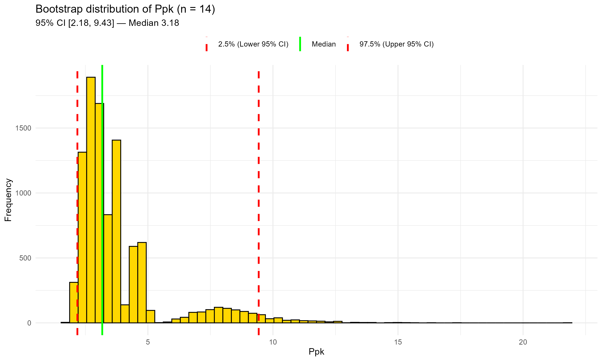
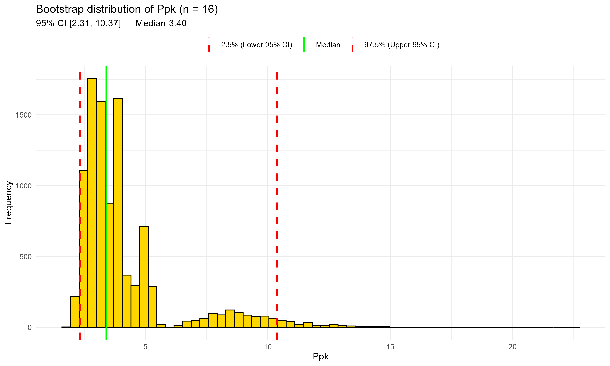

# Chapter 10 — Case Study 4 — Capability Indices in Pharma: When Few, Skewed Data Challenge Model Distributions

In this chapter, we show how a **nonparametric bootstrap** can deliver
defensible **capability (Ppk)** assessments when data are **few and skewed**,
and why relying on a single **model distribution** can be misleading.

&nbsp;

## 💊 Step 1 – Scenario: the real-world setting

In early lifecycle (processes under design, scale-up, technology transfer), capability is often assessed with:

- **few observations** (e.g., a dozen lots),
- **non-normal, right-skewed** data (e.g., residual impurities, microbial counts, residual solvents),
- one-sided specifications (e.g., **USL = NMT (Not More Than) 0.5%**).

&nbsp;

> 📦 **Background Box — Capability indices recap (Cpk vs Ppk)**  
> • **Cpk** (“process capability index”): potential capability under *short-term* variation, using within-subgroup standard deviation.  
> • **Ppk** (“process performance index”): actual performance under *long-term* variation, using overall standard deviation.  
> • Because of the different σ, **Ppk ≤ Cpk** in most real cases.  
> • In GMP settings, **Ppk** is usually preferred for early-lifecycle or “as-is” evaluations of real lots, whereas Cpk is more suitable when a process is stable and subgrouped.

&nbsp;

Fitting a **model distribution** (normal, lognormal, Weibull, etc.) can be fragile: small samples + skewness make **goodness-of-fit (GOF)** inconclusive and **Ppk** highly sensitive to the chosen family.
 A practical alternative is the **nonparametric bootstrap**, which provides a point estimate and an **uncertainty interval** without imposing a shape.

&nbsp;

> 📝 **Note — Capability analysis vs control charts**  
> • **Control charts** (e.g., X-bar, I-MR) are designed to monitor *process stability over time* once the process is established.  
> • **Capability analysis** (Cpk/Ppk) is a snapshot of *how the current distribution relates to specifications*.  
> • In early-lifecycle contexts, capability indices — especially Ppk with bootstrap — provide more informative “as-is” assessments than control charts.

&nbsp;

---

&nbsp;


## 🧩 Step 2 – Classical model-based approach and its limitations

1. Fit several classic families (Normal, Lognormal, Weibull, Exponential, Gamma, Logistic, Loglogistic, …).
2. Rely on GOF tests (e.g., Anderson–Darling or AD).
3. Compute **Ppk** under the selected model.

**Limitations with few, skewed data**

- Different families can all look “plausible enough”, each yielding **very different Ppk**.
- GOF p-values are unstable with n≈10–20.
- The choice becomes **arbitrary**, making the result **hard to defend** (audits/inspections).

&nbsp;

---


&nbsp;

## 🧪 Step 3 – A robust alternative: nonparametric bootstrap for Ppk

Let $\bar{x}$ and $s$ be the sample mean and standard deviation.  
For one-sided specs with USL and (optionally) LSL:

$$
Ppk = \min\left(\frac{\mathrm{USL}-\bar{x}}{3s}, \frac{\bar{x}-\mathrm{LSL}}{3s}\right)
$$

Here $s$ is the overall (long-term) standard deviation; for Cpk, $s$ refers to the within-subgroup standard deviation.

The **bootstrap** resamples the observed data (with replacement), recomputes Ppk thousands of times, and summarizes the distribution (median, **95% percentile CI**).
 It **does not assume** any distributional form and **honestly reflects** uncertainty due to small n and skewness.

&nbsp;

> 📦 **Background Box — Why bootstrap for capability?** 
> With few, skewed lots, goodness-of-fit tests are unstable and model choice
> drives Ppk. The **nonparametric bootstrap** reuses the data themselves to
> quantify uncertainty (median, 95% CI) **without** assuming a shape—perfectly
> aligned with **ICH Q9(R1)** and **USP <1210>** for risk-based reporting.
> *(See also [Chapter 9](chapter09_case-study3.md) for a quick side-by-side of parametric vs nonparametric bootstrap.)*

&nbsp;

---

&nbsp;

> 📦 **Background Box — Parametric vs Nonparametric bootstrap**  
> • **Parametric bootstrap**: assumes a specific distribution (e.g., lognormal) and simulates data from that fitted model.  
> • **Nonparametric bootstrap**: resamples directly from the observed data without assuming any shape.  
> • In early-lifecycle GMP data, the **nonparametric bootstrap** is safer because model fit is often inconclusive.  
> • **When to use**: start nonparametric; switch/compare with parametric only after convincing GOF and stability under plausible alternatives.

&nbsp;

---

&nbsp;

## 📈 Step 4 – Case study — Residual related substance (USL = 0.5%)

&nbsp;

**Aim of this case study.**  
We start with **14 historical lots** and then produce **2 new lots**. Because **Ppk** is a *global* (long-term) index, we first estimate Ppk on the historical data (**n=14**) and then on the combined dataset (**n=16**), using the **nonparametric bootstrap** to report a point estimate and a **95% CI** in both cases. We finally **compare the two results** (median and CI) to judge whether performance is consistent with the past (i.e., still comfortably below the USL).  

This mirrors a **typical GMP scenario** where only a few historical lots are available and new production must be evaluated for consistency; the **bootstrap** provides a defensible, model-free estimate of capability at each stage.

&nbsp;

### 4.1 Data

Historical lots (n = 14), **synthetic but realistic** values (values in %, right-skewed):

```r
0.06, 0.07, 0.08, 0.09, 0.10, 0.12, 0.07, 0.08,
0.09, 0.21, 0.18, 0.08, 0.11, 0.10
```

Two recent lots (values in %):

```r
0.09, 0.085
```

Rationale: positive values with a long right tail (≈0.18–0.21) generate the familiar “model suggestions” (e.g., 3-par Weibull, exponential, loglogistic) in standard GOF menus, yet none is clearly dominant.

&nbsp;

---

&nbsp;


### 4.2 💻 Code (bootstrap calculation)

```r
############################################################
# Capability with few, skewed data: nonparametric bootstrap
# Dataset: related substance, USL = 0.5% (one-sided)
############################################################

## 0) Install & load
install_if_missing <- function(pkgs){
  ip <- rownames(installed.packages())
  for(p in pkgs) if(!p %in% ip) install.packages(p, dependencies=TRUE)
}
install_if_missing(c("ggplot2","boot"))
suppressPackageStartupMessages({
  library(ggplot2); library(boot)
})

## 1) Spec limits
USL <- 0.5
LSL <- NA  # NA if no lower spec

## 2) Data
imp14 <- c(0.06, 0.07, 0.08, 0.09, 0.10, 0.12, 0.07, 0.08,
           0.09, 0.21, 0.18, 0.08, 0.11, 0.10)
imp16 <- c(imp14, 0.09, 0.085)

## 3) Ppk function
ppk_compute <- function(x, USL, LSL=NA_real_){
  m <- mean(x); s <- sd(x)
  if (is.na(s) || s <= 0) return(NA_real_)
  up <- if (!is.na(USL)) (USL - m)/(3*s) else Inf
  lo <- if (!is.na(LSL)) (m - LSL)/(3*s) else Inf
  min(up, lo, na.rm=TRUE)
}

## 4) Bootstrap helper
boot_ppk <- function(x, B=10000L, seed=123){
  set.seed(seed)
  n <- length(x)
  samp <- replicate(B, {
    xi <- sample(x, n, replace=TRUE)
    ppk_compute(xi, USL, LSL)
  })
  list(
    obs = ppk_compute(x, USL, LSL),
    qs  = quantile(samp, c(.025,.5,.975), na.rm=TRUE),
    all = samp
  )
}

## 5) Run for n=14 and n=16
res14 <- boot_ppk(imp14)
res16 <- boot_ppk(imp16)

## 6) Plot helper (one plot at a time)
plot_boot <- function(samples, qs, title_suffix){
  df <- data.frame(Ppk = samples)
  vlines <- data.frame(
    x = as.numeric(c(qs[1], qs[2], qs[3])),
    type = factor(c("2.5% (Lower 95% CI)", "Median", "97.5% (Upper 95% CI)"),
                  levels = c("2.5% (Lower 95% CI)", "Median", "97.5% (Upper 95% CI)"))
  )
  ggplot(df, aes(x = Ppk)) +
    geom_histogram(bins = 60, fill = "gold", color = "black") +
    geom_vline(data = vlines,
               aes(xintercept = x, color = type, linetype = type),
               linewidth = 1) +
    scale_color_manual(values = c("Median" = "green",
                                  "2.5% (Lower 95% CI)" = "red",
                                  "97.5% (Upper 95% CI)" = "red"),
                       name = NULL) +
    scale_linetype_manual(values = c("Median" = "solid",
                                     "2.5% (Lower 95% CI)" = "dashed",
                                     "97.5% (Upper 95% CI)" = "dashed"),
                          name = NULL) +
    labs(title = paste0("Bootstrap distribution of Ppk (", title_suffix, ")"),
         subtitle = sprintf("95%% CI [%.2f, %.2f] — Median %.2f",
                            qs[1], qs[3], qs[2]),
         x = "Ppk", y = "Frequency") +
    theme_minimal(base_size = 11) +
    theme(legend.position = "top")
}

## 7) Produce and save the two single plots
p14 <- plot_boot(res14$all, res14$qs, "n = 14")
p16 <- plot_boot(res16$all, res16$qs, "n = 16")

print(p14); ggsave("ppk_bootstrap_n14.png", p14, width = 10, height = 6, dpi = 300)
print(p16); ggsave("ppk_bootstrap_n16.png", p16, width = 10, height = 6, dpi = 300)

## 8) Console summary
cat("\n================ SUMMARY ================\n")
cat(sprintf("n = 14 | Observed Ppk: %.3f | Bootstrap median: %.3f | 95%% CI: [%.3f, %.3f]\n",
            res14$obs, res14$qs[2], res14$qs[1], res14$qs[3]))
cat(sprintf("n = 16 | Observed Ppk: %.3f | Bootstrap median: %.3f | 95%% CI: [%.3f, %.3f]\n",
            res16$obs, res16$qs[2], res16$qs[1], res16$qs[3]))
cat("=========================================\n")

```

&nbsp;

<p align="center">
  
  <br>
  <em><strong>Figure 10.1</strong> – Bootstrap distribution of Ppk with historical data only (n = 14).  
  Green line: median; red dashed lines: 95% CI bounds.  
  This plot highlights the uncertainty typical of few, right-skewed observations.</em>
</p>

&nbsp;

<p align="center">
  
  <br>
  <em><strong>Figure 10.2</strong> – Bootstrap distribution of Ppk after adding two recent lots (n = 16).  
  Green line: median; red dashed lines: 95% CI bounds.  
  The central estimate shifts slightly upward and the lower CI rises; the upper tail remains long.</em>
</p>

&nbsp;

### 4.3 📊 Visual comparison — n = 14  vs  n = 16

This section contrasts the **baseline** (n=14) and the **updated** (n=16) bootstrap results to check for meaningful shifts in central tendency or uncertainty.

**Numerical summary.**

- **n = 14:** Observed Ppk = **3.101**; Bootstrap median = **3.175**; 95% CI = **[2.181, 9.431]**  
- **n = 16:** Observed Ppk = **3.318**; Bootstrap median = **3.401**; 95% CI = **[2.308, 10.373]**

**Interpretation.**  
Adding two lots shifts the **central estimate** slightly upward (both observed Ppk and bootstrap median), consistent with new values aligned with the historical pattern.  
The **lower CI bound** moves up a bit (2.18 → 2.31), whereas the **upper bound** remains very high and even increases. With few, right-skewed data and very small variability relative to the USL, the bootstrap distribution keeps a **long upper tail**.  
Operationally, the message is stable: the process appears **highly capable** (Ppk ≫ 1), but the **uncertainty is still large**; **Continued Process Verification (CPV)** will reduce it gradually as more lots accumulate.

**Change metrics (n = 16 vs n = 14)**

| Metric            | n = 14 | n = 16 | Δ (16–14) | % change |
|-------------------|:------:|:------:|:---------:|---------:|
| Observed Ppk      | 3.101  | 3.318  | +0.217    | +7.0%    |
| Bootstrap median  | 3.175  | 3.401  | +0.226    | +7.1%    |
| 95% CI lower (L95)| 2.181  | 2.308  | +0.127    | —        |
| 95% CI upper (U95)| 9.431  | 10.373 | +0.942    | —        |
| 95% CI width      | 7.250  | 8.065  | +0.815    | +11.2%   |

> **Interpretation — Why the numbers matter:**  
> The central location (observed Ppk and bootstrap median) increases by ~7%.  
> The lower CI bound improves modestly, while the upper bound moves outward, so the 95 % CI becomes even wider (+0.82).  
> This is consistent with few, right-skewed data and very small variability relative to the USL.  
> **With only 16 lots the bootstrap CI remains necessarily wide; ongoing CPV with more lots will progressively tighten the interval and stabilize the upper tail.**

&nbsp;

---

&nbsp;


### 4.4 🧭 Sensitivity of Ppk to assumed model distribution

Using the same dataset — first the 14 historical lots, then all 16 lots — several model distributions fitted “reasonably well” according to the Anderson–Darling (AD) test, yet yielded very different Ppk values:

| **Distribution**         | **AD (n = 14)** | **p-value** | **Ppk (n = 14)** | **AD (n = 16)** | **p-value** | **Ppk (n = 16)** |
|--------------------------|---------------:|------------:|-----------------:|---------------:|------------:|-----------------:|
| Lognormal                | 0.566          | 0.118       | 2.23             | 0.573          | 0.113       | 2.30             |
| Largest Extreme Value    | 0.547          | 0.156       | 2.60             | 0.553          | 0.150       | 2.64             |
| Loglogistic              | 0.421          | 0.247       | 1.85             | 0.427          | 0.240       | 1.90             |
| Weibull (3-parameter)     | 0.441          | 0.309       | 2.20             | 0.447          | 0.302       | 2.25             |
| Exponential (2-parameter)| 0.463          | >0.250      | 1.51             | 0.469          | >0.250      | 1.54             |
| **Bootstrap (nonparametric)** | —             | —            | **≈3.1 (95 % CI [≈2.2, 9.4])** | — | — | **≈3.3 (95 % CI [≈2.3, 10.4])** |

*Table 10.1 — Sensitivity of Ppk to assumed distribution: with small, skewed data several model distributions fit reasonably well, yet the resulting Ppk ranges from about 1.5 to 2.6. The nonparametric bootstrap gives a central estimate ≈3.1 with a wide 95 % CI, without assuming any model shape.*

> **Interpretation.**  
> • Several model families appear plausible by goodness-of-fit, but each produces a different Ppk.  
> • Going from 14 to 16 lots slightly shifts most parametric Ppk estimates upward but does not fundamentally change the ranking of models.  
> • With only 14–16 observations and a right-skewed distribution, GOF tests cannot reliably pick a “true” model.  
> • The nonparametric bootstrap delivers a single central estimate and an honest confidence interval, without relying on arbitrary distributional assumptions.  
> • The wide CI simply reflects the small sample size; as more lots accumulate the CI will shrink and model-based estimates will stabilize.

This illustrates why, in early-lifecycle pharmaceutical processes, a bootstrap-based capability analysis can be more transparent and defensible than relying on a single fitted distribution.


&nbsp;

> 📌 **Regulatory Note**  
> When model fits yield very different Ppk values, present **both**:
> a model-free bootstrap as the primary estimate **and** a parametric
> sensitivity table. This mirrors the “assumption-light” vs “assumption-rich”
> logic encouraged by lifecycle guidance (ICH Q8–Q12, FDA PV 2011).

&nbsp;

---

&nbsp;

## 🔍 Step 5 – Results and interpretation (what to expect)

- Observed Ppk will be ≫ 1 (values are far below 0.5% and SD is small).
- Bootstrap median close to the observed Ppk.
- 95% CI asymmetric with a long upper tail (small n + small SD, one-sided spec).
- Adding 2 lots (n = 16) barely shifts the center; CI width shrinks slowly — honest uncertainty quantification.

&nbsp;

---

&nbsp;

## 📌 Step 6 – Practical guidance

Report both the observed Ppk and the bootstrap 95% CI.

Prefer percentile CI; try BCa if n is not too small and data aren’t too tied.

Use a clear figure (gold histogram + green median + red CI with legend).

Parametric fits are fine only when (i) GOF is convincing and (ii) results are stable under plausible alternatives.

&nbsp;

---

&nbsp;

## ✅ Step 7 – Key takeaways

With few, skewed pharma data, model choice drives Ppk—and can mislead.

Bootstrap avoids arbitrary shape assumptions and exposes uncertainty transparently.

The approach is simple, reproducible, and defensible in GMP/QA settings.

&nbsp;

[← Previous: Case Study 3 — From 3 Batches to Continuous Confidence](chapter09_case-study3.md) | [▲ Back to top](../#table-of-contents) | [Next: Case Study 5 — Predictive Stability with Monte Carlo →](chapter11_case-study5.md)
