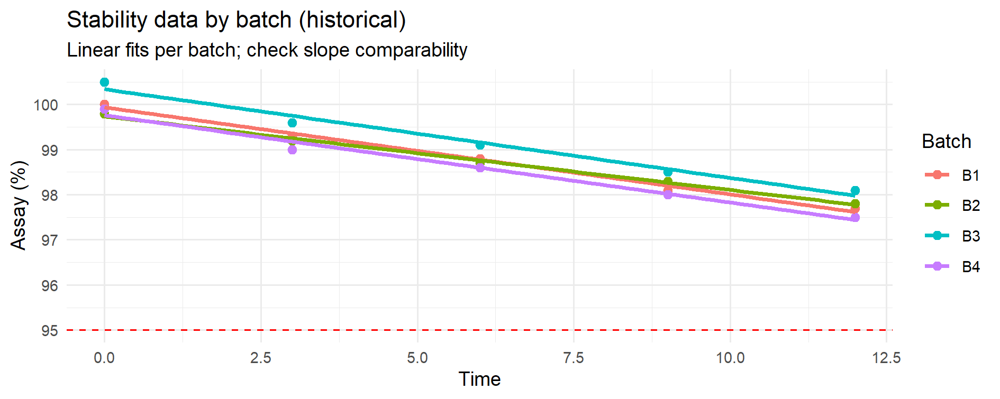

# Chapter 11 — Case Study 5 — Predictive Stability with Monte Carlo

Monte Carlo simulation can be used to **predict future stability points** using historical stability data from previous batches.  
This approach is especially valuable for APIs and finished products where shelf-life decisions are critical.

---

&nbsp;

## 🎯 Scenario

We have stability data from **4 historical batches** (e.g., API assay at 0, 3, 6, 9, 12 months).  

We want to predict whether a **new batch** — for which only early stability points (0–3–6 months) are available —  
will remain within specification **up to the time covered by the historical data (here: 12 months)**.

Specification (one-sided): LSL = 95% (assay).

Predictions at **later time points (e.g., 18–24 months)** can still be generated by the same model,  
but these are **extrapolations beyond the observed domain** and therefore carry **much higher uncertainty**.  
Unless supported by additional evidence (longer historical data, accelerated stability, or a validated kinetic model),  
such long-term forecasts should be treated as **illustrative “what-if” scenarios**, not as regulatory conclusions.

> *This distinction between interpolation (within the observed data) and extrapolation (beyond the observed data)  
> is critical in GMP decision-making and should always be made explicit when reporting predictive stability results.*

For this approach to work:

- Historical batches must be **comparable** (same formulation, packaging, storage conditions).
- Their degradation profiles (slopes) should be **similar enough** (“same family”); if not, a mixed-effects or Bayesian model is needed.
- Uncertainty on the **degradation parameters** is estimated from the historical batches and then applied to the new batch to simulate its future points.

---

&nbsp;

## 🧮 Monte Carlo Approach — Step by Step

1. **Check slope comparability** of historical batches (visual overlay + ANOVA Time×Batch).
2. **Fit a pooled degradation model** on historical data if slopes are comparable.
3. **Quantify parameter uncertainty** with bootstrap draws.
4. **Simulate future points** for the new batch at 12–18–24 months.
5. **Compute risk metrics**:
   - Probability of going below LSL at each future time point (`p_out(t)`).
   - 5–50–95% quantiles of the predicted distribution.

> **Pre-check:** Before fitting a pooled degradation model, verify that historical batches show comparable degradation slopes.  
> If slopes differ significantly, the pooled model with bootstrap is not appropriate; use a mixed-effects model or restrict the dataset.

---

&nbsp;

## 📦 1. Slope comparability check (historical data)

We start with **real numbers** for 4 batches (replace with your own).  
Assay (%) at 0, 3, 6, 9, 12 months:

| Time (m) | B1   | B2   | B3   | B4   |
|----------|------|------|------|------|
| 0        | 100.0| 99.8 | 100.5| 99.9 |
| 3        | 99.3 | 99.2 | 99.6 | 99.0 |
| 6        | 98.8 | 98.7 | 99.1 | 98.6 |
| 9        | 98.1 | 98.3 | 98.5 | 98.0 |
| 12       | 97.7 | 97.8 | 98.1 | 97.5 |

We test if slopes differ significantly across batches.

```r
library(dplyr); library(tidyr); library(ggplot2)

# 1) Create dataset
time_points <- c(0,3,6,9,12)
hist_df <- tribble(
  ~Batch, ~Time, ~Assay,
  "B1",0,100.0,"B1",3,99.3,"B1",6,98.8,"B1",9,98.1,"B1",12,97.7,
  "B2",0,99.8, "B2",3,99.2,"B2",6,98.7,"B2",9,98.3,"B2",12,97.8,
  "B3",0,100.5,"B3",3,99.6,"B3",6,99.1,"B3",9,98.5,"B3",12,98.1,
  "B4",0,99.9, "B4",3,99.0,"B4",6,98.6,"B4",9,98.0,"B4",12,97.5)

# 2) Fit models
fit_no_int <- lm(Assay ~ Time + Batch, data=hist_df)
fit_int    <- lm(Assay ~ Time * Batch, data=hist_df)
anova(fit_no_int, fit_int)  # p > 0.05 -> no evidence of slope differences

# 3) Visual overlay
ggplot(hist_df, aes(Time, Assay, color=Batch)) +
  geom_hline(yintercept = 95, linetype = 2, color = "red") +
  geom_point(size=2) +
  geom_smooth(method="lm", se=FALSE) +
  labs(title="Stability data by batch (historical)",
       subtitle="Linear fits per batch; check slope comparability",
       y="Assay (%)") +
  theme_minimal()
```

&nbsp;

<p align="center">
  
  <br>
  <em><strong>Figure 11.1</strong> – Stability data for 4 historical batches with linear fits.
  Each colored line represents a batch; the dashed line is the lower specification limit (LSL).
  Visual overlay suggests broadly similar degradation slopes.</em>
</p>

&nbsp;

### 11.1 – Checking slope comparability among historical batches

Before developing a predictive stability model, it is essential to verify whether the degradation rate (slope) is comparable across historical batches. If the slopes are statistically similar, the data can be pooled to build a single degradation model; if they differ, each batch (or group of batches) must be modelled separately or a mixed-effects approach should be considered. This preliminary step, recommended in ICH Q1E (“Evaluation of Stability Data”), ensures that the predicted shelf life is scientifically and statistically justified.

&nbsp;

**ANOVA slope comparability test**

| Model comparison | Residual df | RSS   | Df  | Sum Sq | F      | Pr(>F) |
|-----------------|-------------|-------|-----|--------|--------|--------|
| Model 1: Assay ~ Time + Batch (common slope) | 15 | 0.228 |     |        |        |        |
| Model 2: Assay ~ Time * Batch (different slopes) | 12 | 0.162 | 3   | 0.066  | 1.63   | 0.235  |

*Table 11.1 – ANOVA test for slope comparability among historical batches.*

&nbsp;

> **Method note — diagnostic power.**  
> The ANOVA test for slope comparability is sensitive to sample size.  
> With few batches or few time points per batch, real differences in slope may go undetected.  
> In such cases it is advisable to complement the p-value with a visual check of the fitted lines and, if needed, consult more advanced modelling approaches.

&nbsp;

> 📦 **How to read this test**  
> - Model 1 imposes a **common slope** for all batches (same degradation rate) but allows different intercepts.  
> - Model 2 allows a **different slope for each batch** (different degradation rates).  
> - The ANOVA table shows **only the difference** between the two models (Df, Sum Sq, F, p-value) because Model 1 is the baseline reference.

&nbsp;

> 📑 **Background:**  
> - This is the classic **test of slope homogeneity** (sometimes called the “common slope test”).  
> - It is exactly the approach described in **ICH Q1E** (“Evaluation of Stability Data”) for checking whether historical batches can be **pooled** into a single degradation model.  
> - If the test is non-significant (p > 0.05), the slopes are considered statistically similar and a **common shelf life** can be estimated.  
> - If the test is significant (p ≤ 0.05), slope differences are present and batches should be modelled separately or via mixed-effects models.

&nbsp;

> **Interpretation:**  
> - The null hypothesis states “**all batches share the same slope**” versus the alternative “**at least one batch has a different slope**.”  
> - Here p = 0.235 (> 0.05): the observed slope differences are not statistically significant with the data available.  
> - Therefore, for predictive purposes, it is acceptable to **pool the four batches** and fit a single degradation model with a common slope.  
> - This does not imply that batches are identical in every respect; it only indicates that their slopes cannot be statistically distinguished at the current sample size. With more data or larger differences, the outcome might change.

&nbsp;

### 11.1.1 – Concluding remarks

This slope-comparability test provides the statistical justification for pooling or separating batches before predicting stability. When the p-value is greater than 0.05, as in our example, pooling is acceptable and leads to a more robust and parsimonious model for shelf-life estimation. If, instead, the test indicates significant differences, separate or hierarchical models should be fitted. Explicitly documenting this decision path (test performed, result, consequence) strengthens the transparency of the stability evaluation for regulatory submissions.

&nbsp;

> **Model diagnostics.**  
> Before pooling batches, check residual plots, QQ-plots and optionally a Time² term to ensure the linear model is adequate over the observed range (0–12 months).  
> If curvature or heteroscedasticity are evident, consider a weighted least squares (WLS/GLS) fit or a residual (wild) bootstrap.

&nbsp;

---

&nbsp;

## 💻 2. Add the new batch (partial data)

We now have a **new batch** with only early time points:

| Time (m) | NEW  |
|----------|------|
| 0        | 100.1|
| 3        | 99.4 |
| 6        | 98.8 |

We overlay it on the historical data:

```r
new_df <- tribble(
  ~Batch,~Time,~Assay,
  "NEW",0,100.1,
  "NEW",3,99.4,
  "NEW",6,98.8)

all_df <- bind_rows(hist_df, new_df)

ggplot(all_df, aes(Time, Assay, color=Batch)) +
  geom_point(size=2) +
  geom_smooth(method="lm", se=FALSE) +
  geom_hline(yintercept=95, linetype=2) +
  labs(title="Historical batches + NEW batch",
       subtitle="Early stability points of new batch added",
       y="Assay (%)") +
  theme_minimal()
```

<p align="center">
  
  <br>
  <em><strong>Figure 11.2</strong> – Historical batches (B1–B4) with linear fits (coloured lines) overlaid with the early stability points of the new batch (pink).  
  The dashed horizontal line marks the lower specification limit (LSL = 95%).  
  At this stage no modelling of the new batch is performed; its early points are only plotted against the historical trends to visually assess whether its behavior so far is consistent with the established degradation slopes before moving to predictions.</em>
</p>

&nbsp;

> *This is a **visual pre-check** before the predictive step: the early points of the new batch are simply overlaid on the historical degradation trends to visually assess comparability before any modelling or forecasting is performed.*

&nbsp;

---

## 3️⃣ Fit pooled model on historical data and quantify parameter uncertainty via bootstrap

In this section we first fit the **pooled degradation model** using the historical batches only, because these provide the information needed to estimate the common degradation rate.  
We then use **bootstrap resampling** of the historical data, a Monte Carlo method, to quantify the uncertainty in the model parameters (intercept and slope).  
Finally, we apply these bootstrapped parameter sets to the early measurements of the new batch in order to project its assay values at future time points (12, 18 and 24 months).

&nbsp;

> 📑 **Method note — Intuitive explanation of “bootstrap + anchoring”**  
> - The **historical batches** tell us how fast the product usually degrades over time (slope β) and how much variability is normally seen around the regression line (σ).  
> - The **bootstrap** creates many possible slopes β* from the historical data, so we reflect the uncertainty instead of relying on a single estimate.  
> - The **new batch** has only three early points (0–3–6 months). To make predictions for it, we **anchor** each bootstrapped slope β* to these points by re-estimating its intercept α*. This ensures the simulated trend starts from the real level of the new batch rather than from an “average historical” intercept.  
> - Finally, we add the **residual variability σ** from the pooled model, which transfers the expected measurement scatter observed historically to the new batch predictions.  
>   
> 👉 In plain words: *the historical data provide the speed of degradation, the new batch provides its actual starting level, and σ provides the expected scatter around the trend. Combining the three gives a realistic predictive distribution for the new batch.*  

&nbsp;

```r
## ---------------------------------------------------------------------------
## This script performs predictive stability for a new batch using a
## Monte Carlo / bootstrap approach:
##
## 1) It bootstraps the common degradation slope from the historical
##    batches. For each bootstrap draw, it re-estimates the intercept
##    (alpha*) of the NEW batch by anchoring to its early data points
##    (0–3–6 months). This ensures that predictions are aligned with
##    the actual starting level of the NEW batch.
##
## 2) It incorporates the residual standard deviation (σ) from the
##    pooled model to reflect observational variability. As a result,
##    the predicted distributions and risks represent future
##    measurements, not just the mean degradation path.
##
## The outputs (probabilities below LSL, predictive quantiles and
## violin/box plots) provide a quantitative risk assessment of the
## new batch at future time points (12, 18 and 24 months).
## ---------------------------------------------------------------------------

## ---- 3) POOLED + SIMPLE BOOTSTRAP + NEW-BATCH ANCHOR + OBSERVATIONAL σ ----
## Fixes implemented:
## - Ensure Time is numeric (in case it was a factor).
## - After boot(), set explicit column names on boot_res$t so we can index "slope".
## - Anchor predictions to NEW by re-estimating the intercept per draw.
## - Compute observational risk using residual SD (σ) from the pooled model.

library(boot)
library(dplyr)
library(ggplot2)

set.seed(123)
LSL <- 95
future_time <- c(12, 18, 24)
B <- 2000  # bootstrap draws

# --- Safety: ensure numeric Time ---
hist_df <- hist_df %>% mutate(Time = as.numeric(Time))
new_df  <- new_df  %>% mutate(Time = as.numeric(Time))

# 1) Pooled model on historical data (used for σ and as baseline)
fit_pooled <- lm(Assay ~ Time, data = hist_df)
sigma_hat  <- sqrt(sum(residuals(fit_pooled)^2) / df.residual(fit_pooled))  # residual SD (observational)

# 2) Nonparametric bootstrap of coefficients (simple and robust)
boot_fun <- function(d, idx){
  dd <- d[idx, ]
  cf <- coef(lm(Assay ~ Time, data = dd))
  c(intercept = unname(cf[1]), slope = unname(cf[2]))
}
boot_res  <- boot(hist_df, boot_fun, R = B)
coef_mat  <- as.matrix(boot_res$t)
# Give explicit names (boot may drop them)
if (is.null(colnames(coef_mat)) || ncol(coef_mat) != 2) {
  colnames(coef_mat) <- c("intercept", "slope")
}

beta_star <- coef_mat[, "slope"]  # bootstrapped slope b*
# NOTE: we do not use the historical intercept from bootstrap; we anchor to NEW instead.

# 3) Anchor to NEW (re-estimate intercept per draw using NEW 0–3–6)
t_new <- new_df$Time
y_new <- new_df$Assay
alpha_new_star <- sapply(beta_star, function(b) mean(y_new - b * t_new))

# 4) Mean predictions at future times (no measurement error)
mu_mat <- sapply(future_time, function(tt) alpha_new_star + beta_star * tt)
colnames(mu_mat) <- paste0("t", future_time, "m")

# 5) OBSERVATIONAL distributions (future measurements) by adding σ
#    (a) Observational risk P(N(mu, σ^2) < LSL) via closed form
p_out_obs <- sapply(seq_along(future_time), function(j){
  mean(pnorm(LSL, mean = mu_mat[, j], sd = sigma_hat))
})
names(p_out_obs) <- colnames(mu_mat)

#    (b) Observational predictive quantiles by simulating future measurements
obs_mat <- mu_mat + matrix(
  rnorm(B * length(future_time), 0, sigma_hat),
  nrow = B, ncol = length(future_time), byrow = FALSE
)
colnames(obs_mat) <- colnames(mu_mat)
q_obs <- apply(obs_mat, 2, quantile, probs = c(0.05, 0.5, 0.95), na.rm = TRUE)

# 6) OUTPUT for tables (recommended for GMP: risk on FUTURE MEASUREMENT)
p_out     <- round(p_out_obs, 3)
quantiles <- round(q_obs, 2)

print(p_out)
print(quantiles)

# 7) PLOT: observational predictive distributions (consistent with p_out and quantiles)
pred_df <- data.frame(
  value  = c(obs_mat),
  tlabel = factor(rep(colnames(obs_mat), each = nrow(obs_mat)),
                  levels = colnames(obs_mat))
)

ggplot(pred_df, aes(tlabel, value)) +
  geom_violin(trim = FALSE, alpha = 0.5) +
  geom_boxplot(width = 0.15, outlier.size = 0.7) +
  geom_hline(yintercept = LSL, linetype = 2, color = "red") +
  labs(title    = "Predictive distributions for the new batch",
       subtitle = "Violin + boxplot at 12/18/24 months; red dashed line = LSL (observational)",
       x = "Future time point", y = "Predicted Assay (%)") +
  theme_minimal()
```

<p align="center">
  
  <br>
  <em>Figure 11.3 – Predictive distributions at 12, 18 and 24 months (pooled model with bootstrap; observational distributions including residual variability σ).</em>
</p>

&nbsp;

The tables below summarize the predictive outputs from the bootstrap simulation.  
They provide a quantitative risk assessment that can be directly used in GMP decision-making (e.g., shelf-life assignment, accelerated release).

&nbsp;

---

&nbsp;

> Unless otherwise stated, probabilities P(Assay < LSL) refer to **future measurements**  
> and therefore include both parameter uncertainty and residual variability (σ).

&nbsp;

### Table 11.2 – Estimated probability of falling below the LSL

| Future time point | P(Assay < LSL) |
|------------------|----------------|
| 12 months        | 0.0 %           |
| 18 months        | 0.0 %           |
| 24 months        | 9.6 %           |

*Shows the estimated risk of falling below the lower specification limit at each future time point (observational risk, including σ).
Values reported as 0.0% are below the reporting precision with the current simulation settings.*

---

### Table 11.3 – Predictive quantiles of Assay (%) for the new batch

| Quantile         | 12 months | 18 months | 24 months |
|-----------------|-----------|-----------|-----------|
| 5%              | 97.30     | 96.08     | 94.85     |
| 50% (median)    | 97.75     | 96.64     | 95.52     |
| 95%             | 98.22     | 97.15     | 96.14     |

*Predictive interval (5–95%) shows the spread of expected values; the median is the central prediction.*

&nbsp;

*Interpretation (practical use):*  
Taken together, the probability and quantile tables show not only the expected values but also the uncertainty around them.  
At 12 and 18 months the predicted risk of falling below specification is essentially zero, whereas at 24 months it rises to about 10%.  
These figures can be used directly to support shelf-life assignment and to justify regulatory decisions with quantitative evidence.

Presenting both probability of non-compliance and predictive intervals helps regulators and QA to see not only point estimates but the underlying risk distribution.

Model diagnostics (residual plots, QQ-plot, and a curvature check via a Time^2 term) did not indicate material deviations from linearity or normal-error assumptions over 0–12 months. If heteroscedasticity were evident, a WLS/GLS fit or a residual (wild) bootstrap would be adopted.

&nbsp;

> **Method note — batch-level resampling.**  
> On larger or more complex datasets, a *batch-level (cluster) bootstrap* can be used to preserve the within-batch correlation structure when resampling.  
> In balanced designs like the present example, results are typically very similar to the simple (row-level) bootstrap reported here, but the cluster bootstrap can be preferable when batch sizes differ or when within-batch correlation is prominent.

&nbsp;

---

&nbsp;

## 📌 GMP Value

This case study illustrates how a **Monte Carlo approach** (here implemented via bootstrap resampling of the pooled degradation model)  
provides a **quantitative, documented risk assessment** of future stability points without waiting for full real-time data.

- Supports **shelf-life extension** or accelerated release decisions.
- Bridges data across batches/sites, helping to justify consistency to regulators.
- **Key outputs**: `p_out(t)` at 12, 18, 24 months + 5–50–95% quantiles + predictive plots.

This quantitative framework can also be extended to sampling and OC curve analysis.

&nbsp;

[← Previous: Case Study 4 — Capability Indices in Pharma](chapter10_case-study4.md) | [Next: Case Study 6 — Monte Carlo Sampling Plans and Empirical OC Curves →](chapter12_case-study6.md)
