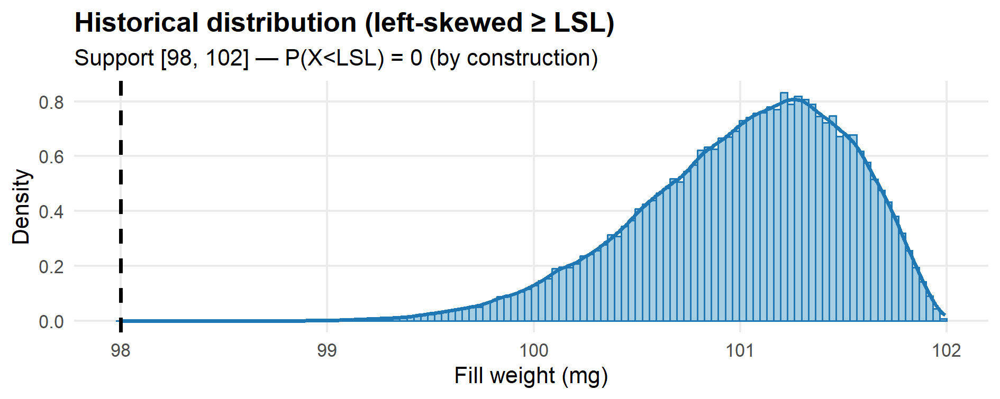
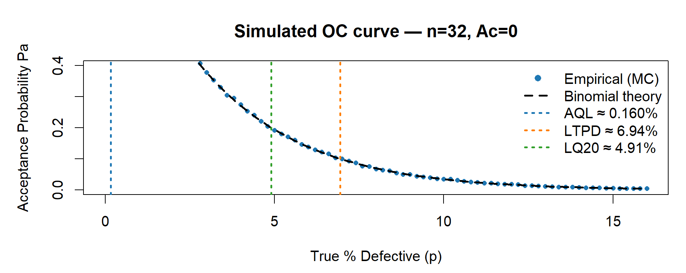
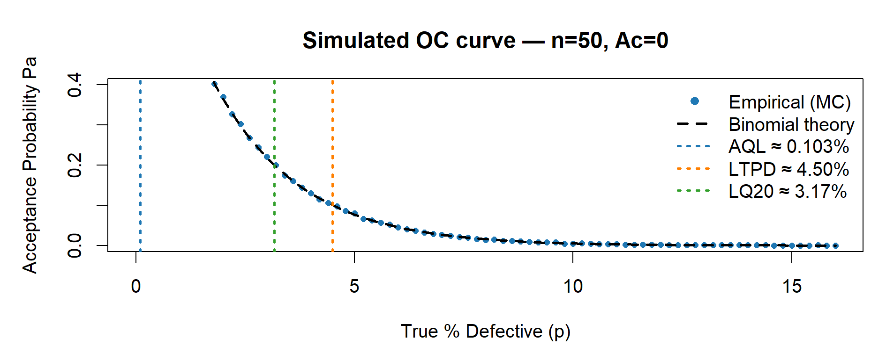
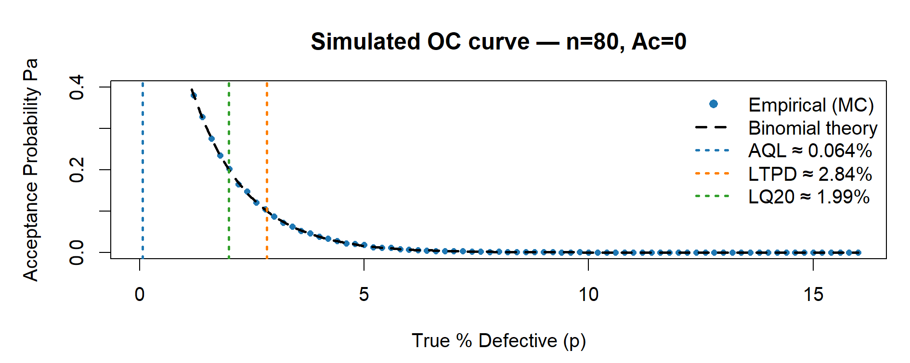
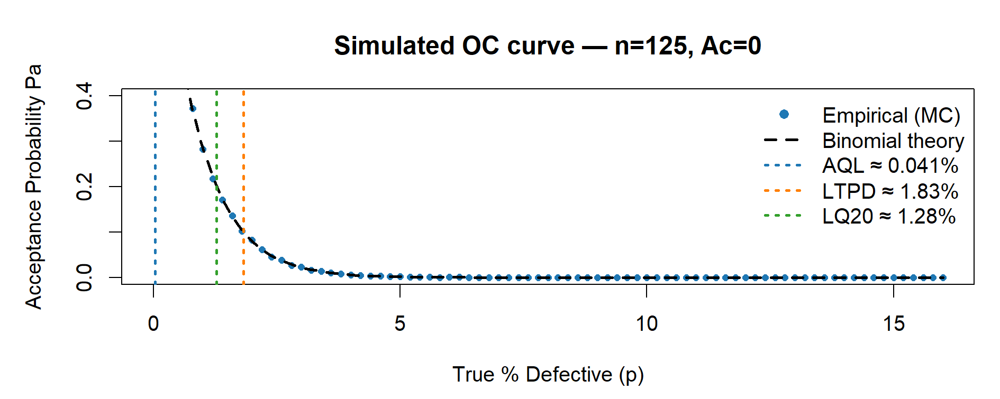

# Chapter 12 — Case Study 6 — Monte Carlo Sampling Plans and Empirical OC Curves

Monte Carlo simulation can be used to **build empirical Operating Characteristic (OC) curves** for sampling plans when **ISO 3951-1** (variables) is **not applicable** due to non-normal data, and **ISO 2859-1** (attributes) would **explode the sample size** (e.g., with **Ac = 0**).  
This case study shows how to leverage **historical, non-normal measurement data** (continuous CQA) to design a **reduced yet defensible** sampling plan.

&nbsp;

---

&nbsp;

## 🎯 Scenario

- CQA (quality characteristic): **Fill weight** per unit (tablets/ampoules; continuous measure).  
- Specification: **LSL = 98.0 mg** (lower spec only; underfill is critical).  
- **Historical measurement data** show **left-skewness** (a heavier left tail), violating ISO 3951-1 normality assumptions.  
- A conservative team would switch to **ISO 2859-1 (attributes)** with **Ac = 0**, but required **sample sizes (n)** quickly become large.  
- **Goal:** use **Monte Carlo** to build **empirical OC curves** from the **historical distribution**, then **choose a smaller sample size n** that still gives acceptable **producer’s risk** (AQL) and **consumer’s risk** (LTPD/LQ20).

> 📦 **Background Box — Why a skewed distribution?**  
> In real GMP operations, fill-weight data are **often close to normal** (CLT).  
> Here, we **deliberately** use a **left-skewed** model to illustrate a case where **ISO 3951-1 is not applicable**.  
> This lets us show how **empirical OC curves** (via Monte Carlo) can justify **reduced sampling** while remaining transparent for QA/regulators.  
> **We deliberately avoid sub-LSL values in the illustrative distribution; this prevents any implicit endorsement of past OOS lots and keeps the example fully GxP-neutral.**

&nbsp;

---

&nbsp;

## ⚖️ Why ISO 3951-1 is not suitable here

- ISO 3951-1 assumes (approximately) **normal** measurements or uses normal-based statistics (e.g., $s$, $\bar{X}$).  
  strong **skewness/heavy tails** invalidate Type I/II risk calibrations.  
- Our data are **left-skewed** (extra probability mass in the underfill tail), so 3951-1 protection levels would be **misstated**.  
- Switching to ISO 2859-1 (attributes) with **Ac = 0** is common, but **n** can become **very large**.

**Solution:** Build an **empirical OC** from the **actual historical shape** (skewness included) and choose **n** to hit practical risk targets.

> **Note.** For attributes plans with Ac = 0, the OC curve depends only on the true defective rate  
> $p = P(X < \mathrm{LSL})$ and on $n$ — i.e. $P_a(p) = (1 - p)^n$.  
> The historical distribution is therefore used to contextualize $p$, not to calibrate $P_a(p)$ beyond its definition.

&nbsp;

---

&nbsp;

## 🧠 Design idea (high level)

1. **Model the historical distribution** of the CQA.  
   For this tutorial, we emulate a **left-skewed** historical shape using a **scaled Beta distribution on [LSL, U]** with **all values ≥ LSL (by construction)**.  
   This provides a realistic left tail while avoiding any sub-LSL values (GxP-neutral). In practice, you would estimate the shape and range from your real data.
2. **Sampling plan(s):** consider **Ac = 0** with several candidate **n** (e.g., 32, 50, 80, 125).  
3. **Monte Carlo OC:** for a grid of **true process states** (e.g., small shifts in the mean or in the tail proportion), simulate lots, draw samples of size $n$, and compute $P_a(p)$ = acceptance probability vs. the true defective rate $p = P(\mathrm{CQA} < \mathrm{LSL})$.
4. **Read off AQL/LTPD/LQ20** from the empirical OC:  
   - AQL: quality level where **Pa ≈ 0.95** (producer’s risk ~5%).  
   - LTPD: quality where **Pa ≈ 0.10** (consumer’s risk ~10%).  
   - LQ20: quality where **Pa ≈ 0.20** (often used in pharma for added conservatism).

&nbsp;

---

&nbsp;

### 🔧 What the R code does (step-by-step)

1. **Historical shape (illustrative).**  
   We generate a **left-skewed** distribution on **\[LSL, U]** via a **scaled Beta** with **all values ≥ LSL**.  
   Purpose: a clean picture of where the true defective rate $p = P(X < \mathrm{LSL})$ would come from.

2. **OC setup.**  
   We fix **uniform axes** (x: 0–16% defectives; y: 0–0.40) and build a fine grid of \(p\) values.  
   For each $p$ and plan $(n, \mathrm{Ac}=0)$, we estimate the **empirical acceptance probability** $P_a(p)$ by Monte Carlo.  
Y-axis zoom set to $P_a$ = 0–0.40 to focus on consumer-risk regions.

4. **Theory overlay.**  
   For $A_c = 0$, acceptance means “zero defectives” in the sample, so:  

$$
P_a(p) = \Pr[K = 0] = (1 - p)^n, \quad K \sim \mathrm{Bin}(n, p).
$$  

The binomial curve is drawn together with the empirical dots (they coincide up to Monte Carlo noise).

5. **Risk markers (closed form).**  
   We mark **AQL/LTPD/LQ20** at the $p$ where $P_a(p) \approx 0.95/0.10/0.20$:  

$$
\mathrm{AQL} = 1 - 0.95^{1/n}, \quad 
\mathrm{LTPD} = 1 - 0.10^{1/n}, \quad 
\mathrm{LQ20} = 1 - 0.20^{1/n}.
$$

6. **Outputs.**  
   We produce **one historical plot** and **four separate OC plots** (for \(n=32,50,80,125\)), plus a **compact summary table** (percent and counts per 1,000,000) — ready for reporting and comparison across plans.

&nbsp;

---

&nbsp;

## 💻 R Code — Empirical OC from Historical (Skewed) Measurements

> ✅ The code below is fully reproducible.  
> Replace the **distribution parameters** (e.g., `alpha_hat`, `beta_hat`, `LSL`, `U`) with those estimated from your historical data to tailor the OC to your process.

```r
# ================================================================
# Case Study 6 — Historical shape (ggplot2) + OC curves (base R)
# - One-sided sampling (Ac = 0), uniform axes across OC figures
# - Legend with AQL / LTPD / LQ20 values included
# - Four separate OC plots: n = 32, 50, 80, 125
# ================================================================

suppressPackageStartupMessages(library(ggplot2))  
set.seed(123)

# -----------------------------
# 0) Setup (one-sided LSL case)
# -----------------------------
LSL <- 98.0
U   <- 102.0  # only for the illustrative historical distribution

# A left-skewed Beta(alpha, beta) on [LSL, U] when alpha > beta:
alpha_hat <- 8
beta_hat  <- 2.6

# Generator for the illustrative “historical” data:
# by construction, ALL values are >= LSL (no OOS).
r_hist <- function(n) LSL + (U - LSL) * rbeta(n, alpha_hat, beta_hat)

# -----------------------------
# 1) Historical distribution
# -----------------------------
hist_x <- r_hist(100000)
stopifnot(all(hist_x >= LSL))  # defensive check

p_hist <- ggplot(data.frame(x = hist_x), aes(x)) +
  geom_histogram(aes(y = after_stat(density)),
                 bins = 120, fill = "#a6cee3", color = "#1f78b4") +
  geom_density(linewidth = 1.1, color = "#1f78b4") +
  geom_vline(xintercept = LSL, linetype = 2, linewidth = 1) +
  labs(title = "Historical distribution (left-skewed ≥ LSL)",
       subtitle = sprintf("Support [%g, %g] — P(X<LSL) = 0 (by construction)", LSL, U),
       x = "Fill weight (mg)", y = "Density") +
  theme_minimal(base_size = 13) +
  theme(plot.title = element_text(face = "bold"),
        panel.grid.minor = element_blank())

print(p_hist)
# ggsave("fig12_1_historical.png", p_hist, width = 10, height = 3.6, dpi = 150)

# -------------------------------------
# 2) OC settings and helper functions
# -------------------------------------
# Uniform axes across all OC plots (for visual comparability)
xlim_percent <- c(0, 16)    # x: 0–16% defectives
ylim_common  <- c(0, 0.40)  # y: Pa 0.00–0.40

# Grid of true defect rates p (in fraction). We will plot in percent.
p_grid <- seq(0, xlim_percent[2] / 100, by = 0.002)

# Monte Carlo reps for empirical Pa; increase if you want smoother dots
reps <- 20000

# Empirical acceptance probability at a given p
Pa_empirical <- function(n, Ac, p, reps = 20000) {
  # For Ac = 0, accept if K = 0 with K ~ Bin(n, p).
  mean(rbinom(reps, size = n, prob = p) <= Ac)
}

# One OC figure (base R): empirical (points) + binomial theory (dashed line)
plot_OC_base <- function(n, Ac = 0L) {
  
  # Curves
  Pa_emp <- sapply(p_grid, function(p) Pa_empirical(n, Ac, p, reps))
  Pa_the <- pbinom(Ac, n, p_grid)  # For Ac=0, equals (1 - p)^n
  
  # Risk points (closed form for Ac = 0)
  p_AQL  <- 1 - 0.95^(1 / n)   # Pa ~ 0.95
  p_LTPD <- 1 - 0.10^(1 / n)   # Pa ~ 0.10
  p_LQ20 <- 1 - 0.20^(1 / n)   # Pa ~ 0.20
  
  # Plot
  par(mar = c(4.5, 4.8, 3.5, 1))
  plot(p_grid * 100, Pa_emp,
       type = "p", pch = 16, cex = 0.7, col = "#1f78b4",
       xlim = xlim_percent, ylim = ylim_common,
       xlab = "True % Defective (p)", ylab = "Acceptance Probability Pa",
       main = sprintf("Simulated OC curve — n=%d, Ac=%d", n, Ac))
  lines(p_grid * 100, Pa_the, lty = 2, lwd = 2, col = "#000000")  # Binomial theory
  
  # Vertical markers (thicker, color-coded)
  abline(v = 100 * p_AQL,  lty = 3, lwd = 2, col = "#1f78b4")  # AQL (blue)
  abline(v = 100 * p_LTPD, lty = 3, lwd = 2, col = "#ff7f00")  # LTPD (orange)
  abline(v = 100 * p_LQ20, lty = 3, lwd = 2, col = "#33a02c")  # LQ20 (green)
  
  # Single legend with numeric values
  legend("topright",
         legend = c("Empirical (MC)",
                    "Binomial theory",
                    sprintf("AQL \u2248 %.3f%%", 100 * p_AQL),
                    sprintf("LTPD \u2248 %.2f%%", 100 * p_LTPD),
                    sprintf("LQ20 \u2248 %.2f%%", 100 * p_LQ20)),
         col    = c("#1f78b4", "#000000", "#1f78b4", "#ff7f00", "#33a02c"),
         pch    = c(16, NA, NA, NA, NA),
         lty    = c(NA, 2, 3, 3, 3),
         lwd    = c(NA, 2, 2, 2, 2),
         pt.cex = 1.0,
         bty    = "n")
  
  # Return the three key percentages (for tables)
  invisible(c(AQL = 100 * p_AQL, LTPD = 100 * p_LTPD, LQ20 = 100 * p_LQ20))
}

# --------------------------------------
# 3) Four separate OC plots (not a panel)
# --------------------------------------
risk_n32  <- plot_OC_base(32,  Ac = 0L)
risk_n50  <- plot_OC_base(50,  Ac = 0L)
risk_n80  <- plot_OC_base(80,  Ac = 0L)
risk_n125 <- plot_OC_base(125, Ac = 0L)

# Optional PNG export:
# png("fig12_2_OC_n32.png", 1400, 500, res = 130);  plot_OC_base(32);  dev.off()
# png("fig12_3_OC_n50.png", 1400, 500, res = 130);  plot_OC_base(50);  dev.off()
# png("fig12_4_OC_n80.png", 1400, 500, res = 130);  plot_OC_base(80);  dev.off()
# png("fig12_5_OC_n125.png",1400, 500, res = 130);  plot_OC_base(125); dev.off()

# --------------------------------------
# 4) Summary tables (percent + counts/1e6)
# --------------------------------------
# First, assemble a compact table with AQL, LTPD, LQ20 by plan:
risk_table <- rbind(
  `n=32,  Ac=0` = round(risk_n32,  3),
  `n=50,  Ac=0` = round(risk_n50,  3),
  `n=80,  Ac=0` = round(risk_n80,  3),
  `n=125, Ac=0` = round(risk_n125, 3)
)

# Then build a data.frame with “clean” column names (no spaces)
risk_df <- data.frame(
  Plan     = rownames(risk_table),
  AQL_pct  = risk_table[, "AQL"],
  LTPD_pct = risk_table[, "LTPD"],
  LQ20_pct = risk_table[, "LQ20"]
)

# Counts per 1,000,000 units (helps with interpretability on slides)
risk_df$AQL_cnt_1e6  <- round(risk_df$AQL_pct  / 100 * 1e6)
risk_df$LTPD_cnt_1e6 <- round(risk_df$LTPD_pct / 100 * 1e6)
risk_df$LQ20_cnt_1e6 <- round(risk_df$LQ20_pct / 100 * 1e6)

print(risk_df, row.names = FALSE)
```
&nbsp;

<p align="center">
  <em><strong>Table 12.1</strong> – Summary of AQL, LTPD and LQ20 values from Monte Carlo simulation
  (percent and counts per 1,000,000 units).</em>
</p>

| Plan        | AQL (%) | LTPD (%) | LQ20 (%) | AQL (count/1e6) | LTPD (count/1e6) | LQ20 (count/1e6) |
|:-------------|--------:|---------:|---------:|----------------:|-----------------:|-----------------:|
| n=32,  Ac=0  | 0.160   | 6.943    | 4.905    | 1,600 | 69,430 | 49,050 |
| n=50,  Ac=0  | 0.103   | 4.501    | 3.168    | 1,030 | 45,010 | 31,680 |
| n=80,  Ac=0  | 0.064   | 2.837    | 1.992    |   640 | 28,370 | 19,920 |
| n=125, Ac=0  | 0.041   | 1.825    | 1.279    |   410 | 18,250 | 12,790 |

*Reading tip.* As \(n\) increases, all three thresholds shift **left** (smaller \(p\)), reflecting a **lower acceptance** at the same defect level (i.e., stronger consumer protection).


### Figure captions

<p align="center">
  
  <br>
  <em><strong>Figure 12.1</strong> – Historical fill-weight distribution (illustrative). 
  The left-skewed Beta model ensures all values are ≥ LSL; no OOS values are simulated. 
  This clarifies why OC curves are interpreted against the true defective rate \(p = P(X<\mathrm{LSL})\).</em>
</p>

<p align="center">
  
  <br>
  <em><strong>Figure 12.2</strong> – Simulated OC curve (n = 32, Ac = 0). 
  Blue points show Monte Carlo estimates; the dashed black line is the binomial theory. 
  Vertical markers identify AQL (≈0.95), LTPD (≈0.10) and LQ20 (≈0.20) acceptance probabilities.</em>
</p>

<p align="center">
  
  <br>
  <em><strong>Figure 12.3</strong> – Simulated OC curve (n = 50, Ac = 0). 
  As n increases, the OC becomes steeper, reducing producer’s risk and improving consumer protection.</em>
</p>

<p align="center">
  
  <br>
  <em><strong>Figure 12.4</strong> – Simulated OC curve (n = 80, Ac = 0). 
  Larger n increases discriminating power, causing AQL/LTPD/LQ20 to shift left (lower p).</em>
</p>

<p align="center">
  
  <br>
  <em><strong>Figure 12.5</strong> – Simulated OC curve (n = 125, Ac = 0). 
  The plan offers the strongest consumer protection but at the cost of the largest sample size.</em>
</p>

&nbsp;

---

&nbsp;

## 🧩 How to adapt to your data

Replace the distribution parameters with estimates from your historical CQA.

Keep Ac = 0 (or set Ac = 1 if justified).

Re-run the simulation to estimate the empirical OC and compare plans.

&nbsp;

---

&nbsp;

## 🏭 GMP / QA Interpretation

This approach respects the real data shape (non-normal), so producer’s and consumer’s risks are calibrated on reality.

It provides a transparent, auditable justification for reduced sampling.

Combine with pilot confirmation runs and CPV monitoring to maintain long-term risk control.

In routine use, confirm with pilot lots and monitor via CPV to maintain targeted $\(P_a\$) levels.

&nbsp;

---

&nbsp;

## ✅ Takeaways

When ISO 3951-1 assumptions fail, empirical Monte Carlo OC curves provide a data-grounded alternative.

They can justify smaller yet statistically defensible sampling plans (e.g., n = 50 instead of 125).

Reading AQL/LTPD/LQ20 directly from simulation ensures traceable risk management aligned with GMP expectations.

&nbsp;

[← Previous: Case Study 5 — Predictive Stability with Monte Carlo](chapter11_case-study5.md) | [▲ Back to top](../#table-of-contents) | [Next: Case Study 7 — Microbiological Counts →](chapter13_case-study7.md)

