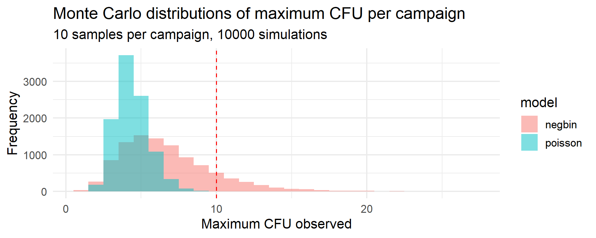

# Chapter 13 — Case Study 7 — Microbiological Counts: Quantifying Overdispersion via Monte Carlo Simulation

&nbsp;

Before diving into model selection, here is a quick overview of the chapter structure:

> 🗺️ **Chapter roadmap**
>
> 
> 1️⃣ Conceptual background — when and why overdispersion arises  
> 2️⃣ Monte Carlo perspective — from single-sample to campaign-level risk  
> 3️⃣ Practical example (R) — simulation and visualization  
> 4️⃣ GMP interpretation and takeaways

&nbsp;

Microbiological count data (CFU per plate or per sample) are discrete and typically show **low means**, often near zero.  
For such data, two statistical models are commonly used: the **Poisson** and the **Negative Binomial (NB or NegBin)**.  
Although closely related, they describe **fundamentally different sources of variability** —  
and the correct choice has direct implications for interpreting GMP environmental and water monitoring results.

---

&nbsp;


## 🎯 Why this matters

In routine GMP monitoring:

- A **Poisson model** is appropriate when the process is *stable and homogeneous* —  
  each sample has the same contamination intensity, and counts fluctuate only by chance.
- A **Negative Binomial model** becomes necessary when the process is *heterogeneous* —  
  some sampling locations or times show higher or lower microbial burden than others.

The distinction determines whether observed “outliers” (e.g., a few plates with unusually high CFU)  
represent true process excursions or just normal statistical variability.

> 💡 *In GMP microbiology, this is not a purely theoretical issue.*  
> The model choice directly affects how “unexpected” results are classified —  
> whether they are treated as **Out of Trend (OOT)** or as **expected variability** due to environmental heterogeneity.

&nbsp;

---

&nbsp;


## 🧩 1. Conceptual background — why overdispersion matters

### (a) Poisson model — homogeneous process

$$
X \sim \mathrm{Poisson}(\lambda),\quad \mathbb{E}[X]=\mathrm{Var}[X]=\lambda
$$

All sampling points share the same contamination intensity ($\lambda$).  
Variance equals the mean ($\mathrm{Var}(X)=\mathbb{E}[X]=\lambda$): randomness alone explains observed variation.
This model fits clean, well-controlled systems (e.g., WFI, cleanrooms).

&nbsp;

---

### (b) Negative Binomial model — heterogeneous process

$$
X \sim \mathrm{NegBin}(\mu, k),\quad \mathbb{E}[X]=\mu,\quad \mathrm{Var}[X]=\mu+\frac{\mu^2}{k}
$$

> **Parameterization note.** We use the mean–dispersion parameterization ($\mu, k$).  
Some software reports Negative Binomial as ($\mathrm{size}=k$, $\mathrm{prob}=p$).  
In our convention: $\mathbb{E}[X]=\mu$, $\mathrm{Var}(X)=\mu+\mu^2/k$,  
and the Poisson–Gamma mixture uses $\lambda \sim \mathrm{Gamma}(\mathrm{shape}=k,\ \mathrm{scale}=\mu/k)$.


Here \(k\) is the **dispersion parameter**:
- Large \(k\) → variance ≈ mean → near-Poisson behavior.  
- Small \(k\) → variance ≫ mean → strong overdispersion.

The Negative Binomial can be seen as a **Poisson–Gamma mixture**:

$$
X \mid \lambda \sim \mathrm{Poisson}(\lambda),\quad 
\lambda \sim \mathrm{Gamma}(\mathrm{shape}=k,\ \mathrm{scale}=\mu/k)
$$

This means that the *rate of contamination (λ)* itself varies among samples —  
reflecting real heterogeneity in space or time.

&nbsp;

---

### (c) Relationship between the two

$$
\lim_{k \to \infty} \mathrm{NegBin}(\mu,k) = \mathrm{Poisson}(\mu)
$$

The Poisson model is thus a special case of the Negative Binomial, valid only when the environment is uniform.

> 🧠 *Interpretation:*  
> - **Poisson:** all sampling sites experience the same microbial load.  
> - **Negative Binomial:** sampling sites differ in their load — some cleaner, some dirtier.  
> - The greater the variability between sites, the smaller the \(k\), and the broader the count distribution.

&nbsp;

> **Quick contrast — operational view**
> | Aspect | Poisson | Negative Binomial |
> |:--|:--|:--|
> | Variability | Random (homogeneous) | Structured (heterogeneous) |
> | Variance–Mean | $Var=\mu$ | $Var=\mu+\mu^2/k$ |
> | Tail behavior | Light | Heavy (higher extreme counts) |
> | GMP implication | True OOL likely anomaly | OOL may reflect expected heterogeneity |

&nbsp;

---

### (d) Practical tool — Index of Dispersion (ID)

A simple way to assess whether data are consistent with the Poisson model is to compute the **Index of Dispersion**:

$$
ID = \frac{s^2}{\bar{x}}
$$

where $s^2$ is the sample variance and $\bar{x}$ the sample mean.

| Interpretation | Condition | Typical model |
|----------------|------------|----------------|
| ID ≈ 1 | Variance ≈ Mean | Poisson (homogeneous process) |
| ID > 1 | Variance > Mean | Overdispersion → Negative Binomial |
| ID < 1 | Variance < Mean | Underdispersion → Binomial or constrained process |

> ℹ️ **Underdispersion is rare in practice.**  
> It typically emerges from constraints or inhibitory mechanisms. In GMP Microbiology it is far less frequent than overdispersion.


> 🧮 *In practice:*  
> - Calculate ID from historical CFU data (e.g., from EM or WFI monitoring).  
> - If ID ≫ 1 (often > 1.5 or 2), the Poisson assumption is violated and a **Negative Binomial** model should be considered.  
> - This diagnostic is simple, intuitive, and easy to justify to non-statisticians or inspectors.

---

&nbsp;

## 🔍 2. Monte Carlo perspective

Monte Carlo simulation is not used here to “fit” the model, but to **explore the practical consequences** of overdispersion.  
Even when Poisson and Negative Binomial models share the same mean (e.g. μ = 2 CFU),  
their predictions differ dramatically in the tails.

For example:

| Model | Mean (μ) | Variance | % of counts > 10 CFU |
|-------|----------:|----------:|--------------------:|
| Poisson (λ = 2) | 2.0 | 2.0 | 0.02 % |
| NegBin (μ = 2, k = 1) | 2.0 | 6.0 | 1.4 % |

Note. Percentages in the table refer to **single-sample** tail probabilities (e.g., one plate, one PW sample, or one swab).  ``

<div style='border:1.5px solid #228be6; background-color:#f0f7ff; padding:10px; border-radius:8px; margin-top:10px; margin-bottom:10px;'>
<b>Terminology — “campaign” (in this chapter)</b><br>
Here, <i>campaign</i> means a <b>sampling session</b> made of multiple individual samples (e.g., 10 plates, PW samples, or swabs collected under similar conditions).  
This is <b>not</b> the manufacturing “production campaign”.
</div>

A Monte Carlo simulation over thousands of hypothetical sampling campaigns allows one to estimate:

- $P(\mathrm{any\ sample} > \mathrm{limit})$: probability of at least one out-of-limit plate,  
- distribution of total CFU counts per campaign,  
- frequency of “false alarms” under each model.

&nbsp;

> 🔬 *Monte Carlo thus provides a bridge between statistical modeling and operational risk:*  
> it quantifies how different assumptions on variability translate into different expected rates of apparent “excursions”.

&nbsp;

> 🧩 Having clarified the conceptual meaning of overdispersion, we now turn to a **Monte Carlo experiment** that visualizes its operational consequences in realistic GMP scenarios.

&nbsp;

---

&nbsp;

## 🧪 3. Practical Example — Monte Carlo Simulation of Overdispersed Counts

### 🎯 Objective

Estimate, via Monte Carlo, how often a monitoring campaign of 10 samples would yield at least one result above 10 CFU,
assuming either a Poisson(λ = 2) or a NegBin(μ = 2, k = 1) model.

### 💻 R Code

```r
# ================================================================
# Case Study 7b — Monte Carlo simulation of microbiological counts
# ================================================================

suppressPackageStartupMessages(library(dplyr))
set.seed(123)

# --- Parameters -------------------------------------------------
n_samples   <- 10      # samples per campaign
n_campaigns <- 10000   # Monte Carlo simulations
limit       <- 10      # CFU threshold
lambda      <- 2       # Poisson mean
mu          <- 2       # NegBin mean
k           <- 1       # NegBin dispersion (overdispersion)

# --- Helper function: simulate campaigns ------------------------
simulate_campaigns <- function(model = c("poisson", "negbin")){
  model <- match.arg(model)
  
  counts <- switch(model,
                   poisson = matrix(rpois(n_samples * n_campaigns, lambda),
                                    ncol = n_samples, byrow = TRUE),
                   negbin  = matrix(rnbinom(n_samples * n_campaigns,
                                            size = k, mu = mu),
                                    ncol = n_samples, byrow = TRUE))
  
  data.frame(
    model     = model,
    max_count = apply(counts, 1, max),
    sum_count = rowSums(counts),
    any_OOL   = apply(counts > limit, 1, any)
  )
}

# --- Run simulations --------------------------------------------
poiss_df <- simulate_campaigns("poisson")
negb_df  <- simulate_campaigns("negbin")
sim_df   <- bind_rows(poiss_df, negb_df)

# --- Summaries --------------------------------------------------
summary_df <- sim_df %>%
  group_by(model) %>%
  summarise(
    P_any_OOL  = mean(any_OOL),
    Mean_max   = mean(max_count),
    Mean_total = mean(sum_count)
  )

print(summary_df)
```

> **Reproducibility note.** All simulations set `set.seed(123)` so results are replicable on re-run.

&nbsp;

**Example output from R simulation:**

| Model    | P(max > 10) | Mean max CFU | Mean total CFU |
|:---------|-------------:|-------------:|---------------:|
| Poisson  | 0.0001 (0.01 %) | 4.39 | 20.0 |
| NegBin   | 0.112 (11.2 %)  | 6.72 | 20.0 |

*Table 13.1 – Monte Carlo summary statistics over 10 000 campaigns.  

Despite identical means (20 CFU per campaign), the Negative Binomial model produces far more campaigns with **max > 10 CFU**.*

*Higher tail probability → higher chance that a multi-sample session contains at least one apparent OOL.*


&nbsp;

### 📊 Visual comparison

```r
library(ggplot2)

ggplot(sim_df, aes(x = max_count, fill = model)) +
  geom_histogram(binwidth = 1, position = "identity", alpha = 0.5) +
  geom_vline(xintercept = limit, linetype = 2, color = "red") +
  labs(title = "Monte Carlo distributions of maximum CFU per campaign",
       subtitle = sprintf("%d samples per campaign, %d simulations",
                          n_samples, n_campaigns),
       x = "Maximum CFU observed", y = "Frequency") +
  theme_minimal(base_size = 13)
```
&nbsp;

The histograms below visually highlight how overdispersion amplifies the probability of extreme counts.

&nbsp;

<p align="center">
  
  <br>
  <em><strong>Figure 13.1</strong> – Monte Carlo distributions of maximum CFU per campaign.  
  Each campaign consists of 10 samples, and the histogram shows the simulated distribution of the highest CFU observed  
  across 10 000 campaigns under Poisson (blue) and Negative Binomial (pink) assumptions.  
  The dashed red line marks the 10 CFU limit used to classify “out-of-limit” events.</em>
</p>

&nbsp;

### 🧮 Index of Dispersion check

The ID is computed on **raw per-sample counts** (all samples from all campaigns), as defined in §1(d).

```r
# Re-simulate raw per-sample counts for ID (same parameters, same seed)
set.seed(123)
counts_poiss <- rpois(n_samples * n_campaigns, lambda)
counts_negb  <- rnbinom(n_samples * n_campaigns, size = k, mu = mu)

ID_df <- dplyr::tibble(
  Model = c("Poisson", "NegBin"),
  Mean  = c(mean(counts_poiss), mean(counts_negb)),
  Var   = c(var(counts_poiss),  var(counts_negb))
) |>
  dplyr::mutate(ID = Var / Mean)

print(ID_df)
```

&nbsp;

**Example output from R simulation:**

| Model   | Mean | Variance | Index of Dispersion (ID) |
|:--------|------:|----------:|-------------------------:|
| Poisson | 2.00  | 2.00     | 0.999 |
| NegBin  | 2.00  | 6.02     | 3.02 |

*Table 13.2 – Index of Dispersion (ID) calculated on **raw per-sample counts** (all samples across all campaigns).  
Consistent with theory: Poisson → ID ≈ 1; Negative Binomial → ID ≈ 3 (overdispersion).*

*Empirical ID confirms theoretical expectations: Poisson ≈ 1, NegBin ≫ 1.*


&nbsp;

---

&nbsp;

## 🧭 GMP interpretation

&nbsp;

| Model | Typical environment | Expected OOL frequency (with §3 parameters) | GMP interpretation |
|:------|---------------------|--------------------------------------------:|:-------------------|
| **Poisson** | Highly controlled areas (Grade A/B, WFI) | ≈ 1 in 10 000 campaigns | OOL → likely true anomaly |
| **NegBin**  | Variable areas (Grade C/D, non-sterile zones) | ≈ 1 in 9 campaigns | OOL → possibly expected (natural variability) |

<p align="center">
  <em><strong>Table 13.3</strong> – Expected frequency of “out-of-limit” results under Poisson vs. Negative Binomial models 
  <br>(given the Monte Carlo setup in §3). The Poisson assumption suits uniform, low-variability systems, 
  while the Negative Binomial model accommodates heterogeneous microbial loads across space or time.</em>
</p>

> 🧠 *Monte Carlo bridges statistical theory and operational interpretation:*  
> it shows that apparent “outliers” can arise naturally from overdispersed processes  
> and should not always trigger full investigations if supported by historical evidence.  
>  
> *Overdispersion is not an error, but a measurable property of the process —  
> it reflects heterogeneity rather than instability.*

&nbsp;

### ✅ Key Takeaways

> - **Same mean, different risk:** variability drives tail behavior and apparent OOL frequency.  
> - **Monte Carlo quantifies risk:** translates overdispersion into probabilities of excursions.  
> - **ID is a fast diagnostic:** detect Poisson inadequacy early (ID ≫ 1).  
> - **GMP-consistent rationale:** objective, reproducible interpretation of OOT events.

&nbsp;

<div style="border: 2px solid #228be6; background-color: #f0f7ff; padding: 12px; border-radius: 10px;">
<strong>💡 Key insight — Monte Carlo as a quantitative risk estimator</strong><br>
In microbiological monitoring, the Monte Carlo method acts as a <strong>quantitative risk estimator</strong>, translating the inherent randomness of counts into measurable probabilities of excursions.  
This transforms subjective notions of “rare” or “unexpected” events into <strong>data-driven, reproducible indicators of process control</strong> — a decisive step toward quantitative risk management in GMP microbiology.
</div>

&nbsp;

---

> 📘 **Summary**
> - \(Var = Mean\) → homogeneous → Poisson model.  
> - \(Var > Mean\) → heterogeneous → Negative Binomial model.  
> - The dispersion parameter \(k\) quantifies the degree of heterogeneity.  
> - Monte Carlo simulation turns these abstract differences into concrete, risk-based predictions.

&nbsp;

> 🧩 *Next connection:* The same Monte Carlo logic used here for microbiological counts extends naturally to other low-rate phenomena (e.g., excursions in stability or sporadic process anomalies).


---

[← Previous: Case Study 6 — Monte Carlo Sampling Plans and Empirical OC Curves](chapter12_case-study6.md) | [▲ Back to top](../#table-of-contents) | [Next: Chapter 14 — Decision & Risk →](chapter14_decision-risk.md)
