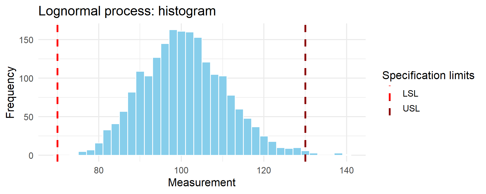
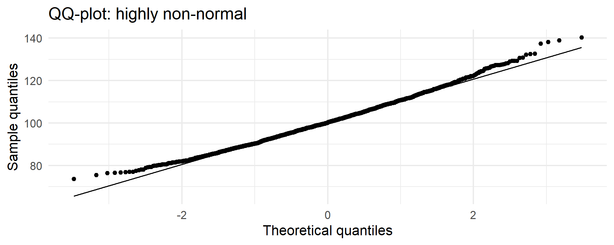

# Chapter 14 — Case Study 8 — Monte Carlo Percentile-Based Capability for Non-Normal Data

&nbsp;

> 🗺️ **Chapter roadmap**  
> 1️⃣ Why classical Cp/Cpk fail for non-normal data  
> 2️⃣ Percentile-based capability: concept and intuition  
> 3️⃣ Monte Carlo & bootstrap approach  
> 4️⃣ Practical case: lognormal process (R)  
> 5️⃣ GMP interpretation and takeaways

&nbsp;

## 🎯 Why this case matters

In GMP environments, capability indices (Cp, Cpk) are widely used but **rarely questioned**.  
They assume a normal, symmetric distribution of data and rely entirely on the pair *(mean, standard deviation)*. 
In a normal distribution, in fact, these two parameters are sufficient to describe the entire curve.

> Yet many pharmaceutical data sets are **not normal** – they are skewed, bounded, or heavy-tailed.  
> In these cases, Cp and Cpk become **misleading**, sometimes severely.

&nbsp;

> ⚠️ **Important note**  
> Cp and Cpk are not “wrong” per se — they become misleading **only when they are  
> computed under the assumption of normality** while the underlying data are not
> normal.
> In such cases, their interpretation breaks down because the ±3σ logic no longer
> corresponds to the actual tails of the distribution.  

&nbsp;

Examples of non-normal data sets are numerous, for instance:

- **Fill weights / uniformity of weight**  
  Often nearly normal but with **systematic left-skew** due to physical constraints, feedback control, or intermittent powder flow.
- **Dissolution**  
  Commonly right-skewed (near 100% boundary, or governed by Noyes–Whitney kinetics).
- **Biological assays / titres**  
  Highly variable, multiplicative, often lognormal.
- **Process times**  
  Always positive → Gamma-like, with long right tail.
- **Impurities & degradants**  
  Lower bound at zero → strong skew in realistic datasets.

Despite this, many organisations continue to calculate Cp/Cpk as if the data were normal.

&nbsp;

> 💡 **Key message**  
> If the data are not normal, ±3σ does *not* correspond to a 99.73% coverage interval.  
> Cp and Cpk may:
> - overestimate capability (process seems “excellent” but is not),  
> - underestimate capability (false alarms),  
> - or produce meaningless numbers (e.g., negative predicted limits, huge upper tails).

&nbsp;

This Case Study shows how to replace σ-based indices with **percentile-based capability metrics** derived from:
- the **empirical distribution**,  
- a **bootstrap distribution**, or  
- a **Monte Carlo model** consistent with the data.

This approach is fully aligned with USP <1210>, <1220>, ICH Q14, and the GxP focus on **data realism**.

&nbsp;

---

## 🧩 1. Classical Cp/Cpk and why they fail

### (a) Classical definitions

For a two-sided specification (LSL, USL):

$$
Cp = \frac{USL - LSL}{6\sigma}, \qquad
Cpk = \min\left( \frac{USL - \mu}{3\sigma}, \frac{\mu - LSL}{3\sigma}\right)
$$

These formulas presuppose:
1. Normality  
2. Symmetry  
3. That ±3σ accurately estimates population tails  

### (b) When the assumptions break

If the distribution is skewed:

- The mean is pulled toward the long tail.  
- The standard deviation grows disproportionately due to tail values.  
- The “six sigma spread” becomes unrealistic.  
- The tails are not symmetric.  
- ±3σ may not correspond to any plausible coverage.

**Intuitive example (no formulas):**  
Consider a lognormal process with mean around 100 and a CV of 10%.
The histogram may look tight and well-controlled, but because of skewness **the sample standard deviation is inflated by the long right tail.**
When this inflated σ enters the Cpk formula, the index may become artificially high (e.g., Cpk > 2), even though the vast majority of values are concentrated close to the median.

In other words, **the process appears more capable on paper than it truly is.**

&nbsp;

---

&nbsp;

## 🧠 2. Percentile-based capability: the intuitive idea

&nbsp;

> ⚠️ **Before going further — always check normality**
> Classical Cp/Cpk assume that data follow a normal distribution.
> Before applying them, one should always verify whether normality is plausible (e.g., via histogram, QQ-plot, Shapiro–Wilk, Anderson–Darling, or graphical diagnostics).
> This case study starts from the practical observation that many GMP datasets *fail* this assumption.

Instead of assuming a normal distribution, we ask:

> *“What are the actual tails of the distribution — as seen in the data?”*

- We use:
  - the **median**, which corresponds to the 50th percentile, instead of the mean (robust to skew).

  The median (50th percentile) is chosen because it is robust to skewness and represents the central tendency more faithfully than the mean in non-normal data.
  - the **0.135%** and **99.865%** percentiles instead of ±3σ.

These two percentiles correspond to the same coverage as ±3σ *in a normal distribution*,  
but here they are taken directly from:

- the empirical data,
- the bootstrap,
- or a fitted Monte Carlo model.

&nbsp;

> 💬 **Why 0.135% and 99.865%?**
>
> In a normal distribution, the interval ±3σ corresponds exactly to the region between  
> the **0.135th percentile (z = –3)** and the **99.865th percentile (z = +3)**.  
> This covers **99.73%** of all values.
>
> When the data are *not* normal, ±3σ no longer has this interpretation —  
> but the **percentile positions preserve the meaning**:  
> they still mark the boundaries that capture the central 99.73% of the distribution,  
> now estimated from the **true, empirical** shape of the data rather than from an assumed normal model.

&nbsp;

### (a) Upper percentile-based capability

$$
C_{p,u}^{(p)} = \frac{USL - \mathrm{median}}{q_{99.865} - q_{50}}
$$

&nbsp;

### (b) Lower percentile-based capability

$$
C_{p,l}^{(p)} = \frac{\mathrm{median} - LSL}{q_{50} - q_{0.135}}
$$

&nbsp;

### (c) Two-sided percentile capability

$$
C_{pk}^{(p)} = \min(C_{p,u}^{(p)}, C_{p,l}^{(p)})
$$

These definitions:
- require no assumption of normality,  
- adapt to the true shape of the distribution,  
- maintain the intuitive meaning of Cp/Cpk (distance to the specification relative to variability),  
- are stable across skewed or heavy-tailed data.

&nbsp;
> This approach preserves the intuitive interpretation of Cp/Cpk (distance to specification 
> divided by process spread) while replacing the assumed ±3σ interval with a data-driven 
> interval derived from the actual distribution.

---

&nbsp;

## 🔍 3. Monte Carlo and bootstrap: how they enter

> ⚠️ **Terminology recap.**
>
> Parametric Monte Carlo: simulate data from a fitted distribution (e.g., lognormal with estimated μ, σ).
>
> Non-parametric bootstrap: resample the observed data directly, without assuming any distribution.
>
> Both methods create a large number of “virtual datasets”, allowing estimation of percentiles and capability indices in a distribution-free way.

&nbsp;

### Two approaches are possible:

### **(A) Parametric Monte Carlo**
Assume a model (e.g., lognormal)  
→ estimate its parameters  
→ simulate 100k values  
→ compute percentiles from the simulated distribution.

Advantages:
- very smooth percentiles  
- good for predictive scenarios  
- ideal when data are few

### **(B) Non-parametric Bootstrap**
Use the actual data  
→ resample with replacement  
→ compute percentiles for each bootstrap dataset  
→ obtain confidence intervals for the percentile-based Cpk.

Advantages:
- distribution-free  
- aligns perfectly with USP <1220>  
- excellent for “GMP realism”

We will show both in the practical section.

---

&nbsp;

## 🧪 4. Practical Case – A lognormal process (R)

&nbsp;

### 🔧 R setup and simulation

```r
# ==========================================================
# Case study 8 - Lognormal process & capability indices
# ==========================================================

suppressPackageStartupMessages(library(dplyr))

set.seed(123)              # to make the results reproducible

# --- Process & specs ---------------------------------------

# Simulated lognormal process (skewed but realistic)
n      <- 2000             # number of simulated observations
mu_log <- log(100)         # median = 100 (lognormal position parameter)
sd_log <- 0.1              # log sd: here ≈ CV 10%
USL    <- 130              # specification limits
LSL    <- 70

# Simulation of a lognormal process (skewed but realistic)
x <- rlnorm(n, meanlog = mu_log, sdlog = sd_log)

# --- Classical Cp e Cpk (assuming normality) --------------
Cp_classic <- (USL - LSL) / (6 * sd(x))
Cpk_classic <- min((USL - mean(x)) / (3 * sd(x)),
                   (mean(x) - LSL) / (3 * sd(x)))

# --- Empirical percentiles corresponding to ±3σ ------------
q <- quantile(x, probs = c(0.00135, 0.5, 0.99865))
q_lower <- q[1]; q_med <- q[2]; q_upper <- q[3]

# --- Percentile-based capability ---------------------------
Cpu_p <- (USL - q_med) / (q_upper - q_med)
Cpl_p <- (q_med - LSL) / (q_med - q_lower)
Cpk_p <- min(Cpu_p, Cpl_p)

# --- Bootstrap for CI of Cpk_percentile --------------------
B <- 2000
Cpk_boot <- numeric(B)

for(i in 1:B){
  xb <- sample(x, replace = TRUE)
  qb <- quantile(xb, probs = c(0.00135, 0.5, 0.99865))
  Cpu_b <- (USL - qb[2]) / (qb[3] - qb[2])
  Cpl_b <- (qb[2] - LSL) / (qb[2] - qb[1])
  Cpk_boot[i] <- min(Cpu_b, Cpl_b)
}

Cpk_ci <- quantile(Cpk_boot, probs = c(0.025, 0.975))

# --- Summary results -----------------------------------------
list(
  Cp_classic = Cp_classic,
  Cpk_classic = Cpk_classic,
  Cpk_percentile = Cpk_p,
  Cpk_percentile_CI = Cpk_ci
)
```
&nbsp;

### 📊 Visual comparison: classical vs percentile-based capability

```r
library(ggplot2)

specs <- data.frame(
  limit = c(LSL, USL),
  type  = c("LSL", "USL")
)

# Histogram
p1 <- ggplot(data.frame(x), aes(x)) +
  geom_histogram(binwidth = 2, fill = "skyblue", color = "white") +
  geom_vline(data = specs,
             aes(xintercept = limit, color = type),
             linetype = "dashed", size = 1.0) +
  scale_color_manual(values = c("LSL" = "red", "USL" = "darkred")) +
  labs(title = "Lognormal process: histogram",
       x = "Measurement", y = "Frequency",
       color = "Specification limits") +
  theme_minimal(base_size = 13)

# QQ-plot
p2 <- ggplot(data.frame(x), aes(sample = x)) +
  stat_qq() +
  stat_qq_line() +
  labs(title = "QQ-plot: highly non-normal",
       x = "Theoretical quantiles", y = "Sample quantiles") +
  theme_minimal(base_size = 13)

print(p1)
print(p2)

```
&nbsp;


<p align="center">
  
  <br>
  <em><strong>Figure 14.1</strong> – Histogram of the simulated lognormal process.  
  The distribution is clearly right-skewed. The dashed red vertical lines mark the lower (LSL = 70)  
  and upper (USL = 130) specification limits. Although the bulk of the distribution appears  
  well-centered, the asymmetric tail plays a dominant role in capability assessment.</em>
</p>


<p align="center">
  
  <br>
  <em><strong>Figure 14.2</strong> – Normal QQ-plot of the simulated process.  
  The central portion of the data lies close to the normal reference line,  
  but both tails deviate markedly — a signature of strong right-skewness.  
  This tail behaviour is what invalidates classical Cp/Cpk assumptions.</em>
</p>


> ### 📌 Why the QQ-plot indicates non-normality even if the center looks normal  
> The central part of many skewed distributions can appear approximately linear in a QQ-plot,  
> giving the impression of near-normality.  
> However, capability indices (Cp, Cpk) depend critically on the **tails**, not the center.  
> In this dataset, both tails deviate markedly from the normal reference line —  
> a signature of lognormal or gamma-like behaviour.  
> For capability purposes the data are therefore **highly non-normal**, even if the central mass  
> looks superficially close to normal.


### 📈 Summary table — classical vs percentile-based capability

| Metric                                      | Value (this example) |
|---------------------------------------------|----------------------:|
| Classical Cp                                | 0.988 |
| Classical Cpk                               | 0.962 |
| Percentile-based Cpk                        | 0.794 |
| Percentile-based Cpk (95% CI, bootstrap)    | 0.758 – 0.974 |


**Numerical results**
The simulated lognormal process yields:

Cp ≈ 0.99: the overall spread (USL–LSL) relative to 6·σ suggests a marginally capable process.

Cpk ≈ 0.96: the classical index, based on the mean and σ, indicates borderline capability.

Percentile-based Cpk ≈ 0.79: once the real data tails are used instead of ±3σ, capability decreases notably.

95% CI (0.76–0.97): the true Cpk is uncertain and the classical Cpk lies near the upper bound of the plausible range.

These values illustrate how classical Cpk can be overly optimistic when data are skewed.

**Interpretation:**  

- Classical Cpk (~0.96) suggests a process close to the “acceptable” threshold of 1.0.  
- Percentile-based Cpk (~0.79) shows that, once the real skewed tails are respected, capability is clearly lower.  
- The bootstrap 95% CI (0.76–0.97) confirms substantial uncertainty: the classical Cpk lies near the **upper end** of the plausible range, i.e., it is an *optimistic* estimate.
  

&nbsp;

---


> 💡 **GMP Insight — Why this matters operationally**  
> - A skewed distribution can make **classical Cpk look excellent** even when a process is at real risk.  
> - Percentile-based Cpk quantifies **actual tail risk**, not the idealised risk implied by ±3σ.  
> - This aligns with the shift toward **quantitative risk management** in ICH Q9(R1) and USP \<1220\>.

---

&nbsp;

## 🧭 5. GMP interpretation

Percentile-based capability:
- is **distributionally appropriate**,  
- respects the real shape of the data,  
- avoids misleading Cp/Cpk inflation or deflation,  
- can be defended to inspectors with high clarity,  
- provides a robust, quantitative complement to graphical tools.

> 💡 **Regulatory alignment**  
> - ICH Q14 emphasises understanding and modelling of variability.  
> - USP <1210> recommends model-matched or distribution-free analyses.  
> - USP <1220> encourages the use of simulation, Bayesian, and resampling-based methods.  
> Percentile-based capability fits perfectly into this framework.

---

&nbsp;

## ✅ Takeaways

> - Cp/Cpk assume normality; many pharma datasets violate this assumption.  
> - Percentile-based indices capture the *true* variability.  
> - Monte Carlo and bootstrap transform capability into a **distribution-free, data-realistic** metric.  
> - This approach produces indices that match the real behaviour of the process — not the idealised one.

---

[← Previous: Case Study 7 — Microbiological Counts](../chapter13_case-study7.md) | [▲ Chapter Index](../index.md#table-of-contents) | [Next → Case Study 9](../chapter15_case-study9.md)
